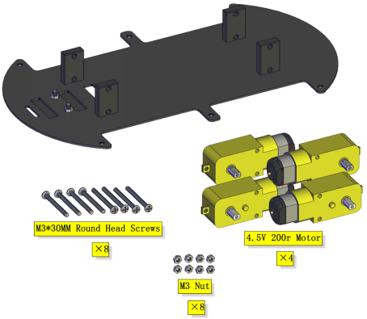
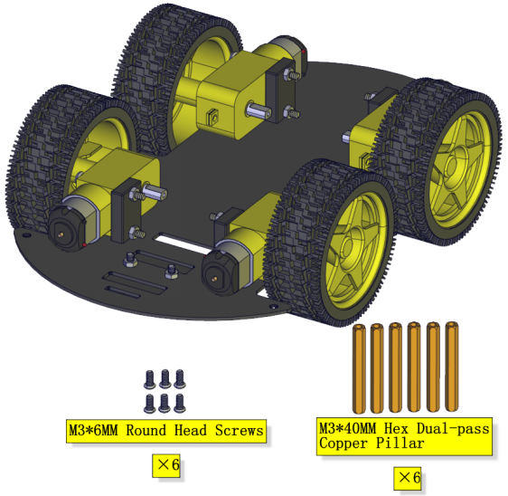
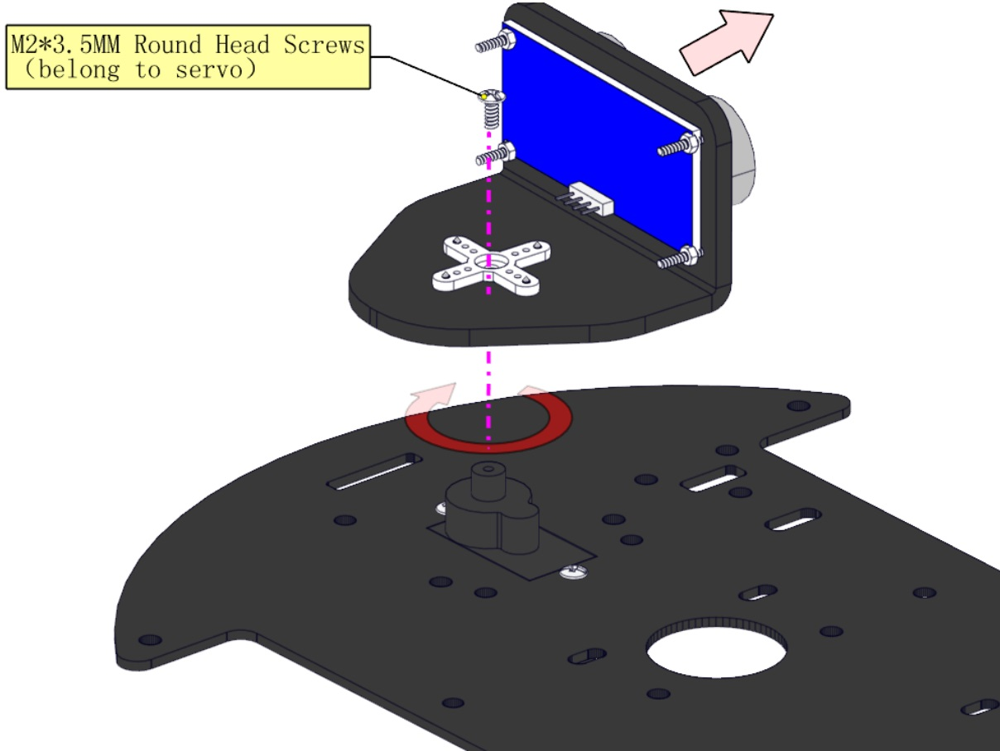
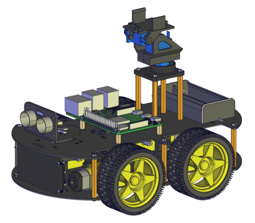
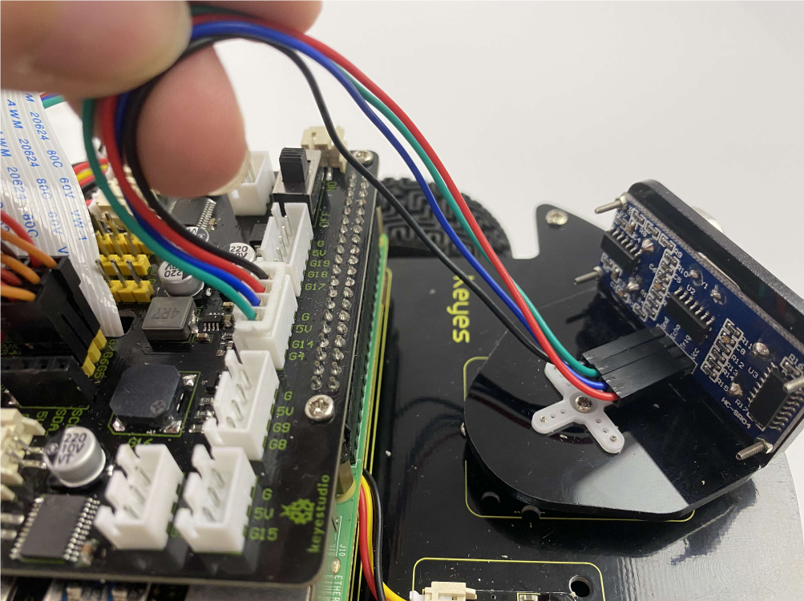
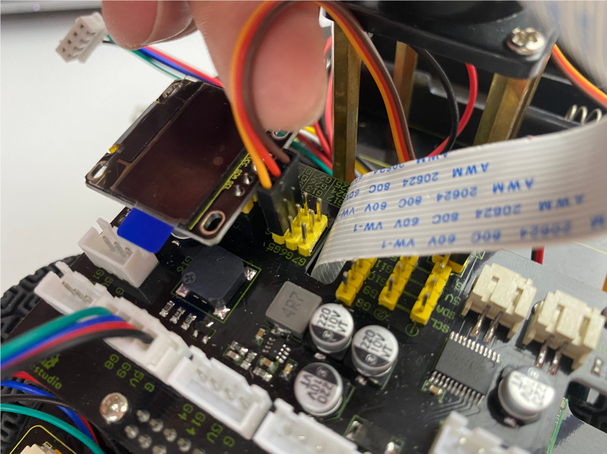

# 1.Assembley Tutorial

## Raspberry Pi Car

**Step 1**

Prepare components

follow the silk print to assemble

Complete

**Step 2**

Prepare components

Assemble fixed parts

Complete

**Step 3**

Prepare components

Mount four motors（Note the placement direction of motor，the wires on all four motors are facing inward）

Complete

**Step 4**

Prepare components

Install wheels

Complete

**Step 5**

Prepare components

Assemble copper pillars

Complete

**Step 6**

Prepare components

Assemble the servo

Complete

**Step 7**

Prepare components

Assemble the ultrasonic sensor

Complete

**Step 8**

Prepare components

Mount the cross servo horn

Complete

**Step 9**

Prepare components

Assemble it on the board

Complete

**Step 10**

Prepare components

Fix the Raspberry Pi board（Raspberry Pi board is not included）

Complete

**Step 11**

Prepare components

Install

Complete

**Step 12**

Prepare components

Fix the battery holder as figures shown

Complete

**Step 13**

Prepare components

Install

Complete

**Step 14**

Prepare components

Wire up the 8*16 dot matrix

Hook up the line tracking sensor(Note:the other end of the wire needs to go through the hole)

Pull all wires through holes on the PCB(Note:the wires of the 4 motors, the wires of the Servo, the wires of the tracking sensor and the wires of the 8*16 LED Panel all need to pass through the gap on the PCB board.) 

Mounting screw

Complete

**Step 15**

Prepare components

Mounting screw

Complete

**Step 16**

Install components 

Don’t remove the connection wire of the camera

Complete

**Step 17**

Assemble components

Install

Complete

**Step 18**

Assemble components 

Note that the logo side of the cooling fan faces downward

Complete

**Step 19**

Mount components

Install

Complete

**Step 20**

Assemble components

Wire up the connection wire of the camera

First, the wire of the camera is tightly inserted into the slot, and then the black plastic sheet is pressed down with your hand。

Complete

**Step 21**

Prepare components

Fix the OLED display module

Complete

**Wiring up**

Cooling fan

Ultrasonic Module

Servo controlling the ultrasonic sensor

Servo on the base 

Servo controlling the camera

IR receiver module

8*16 dot matrix LED Panel

Line tracking sensor

M2 Motor

M1 Motor

M4 Motor

M3 Motor

Wire up the power

