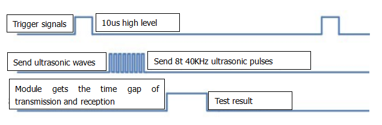
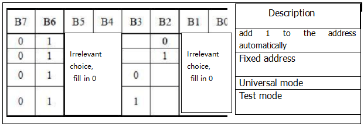
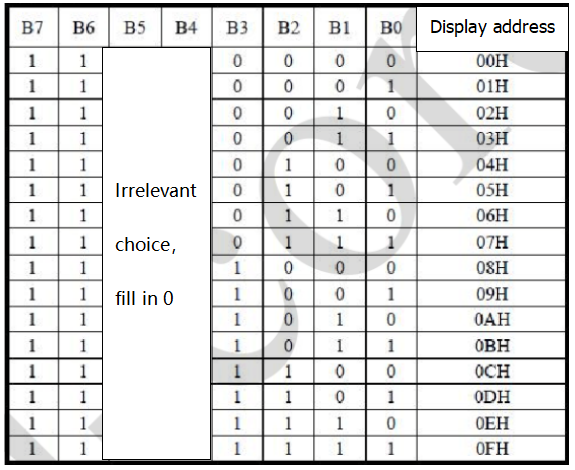
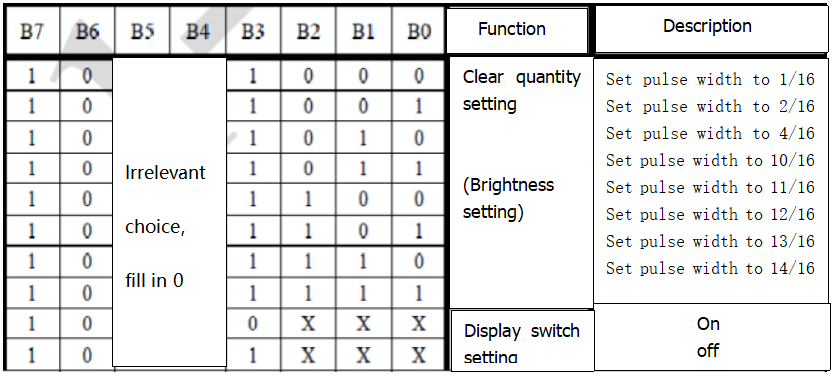
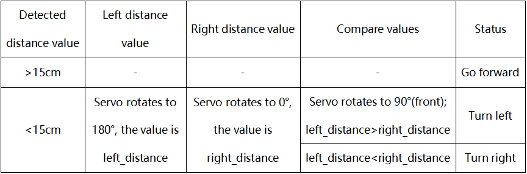

# 3.Raspberry Pi Hardware Control

<span style="color: rgb(255, 76, 65);">Note: need to turn off the programme of boot-up, then follow the below instructions</span>

Open the terminal and input **sudo nano /etc/rc.local** then press **Enter**.


Add <span style="color: rgb(255, 76, 65);">#</span> before enabling the scripts, as shown below:


Press **Ctrl + o** to save, then press Enter and **Ctrl + X** to exit editing

## **Raspberry Pi Control Project**

### Expansion Board

When programming GPIO pins, there are three different ways to refer to them: BCM GPIO number, physical number and WiringPi GPIO number.
Generally the WiringPi GPIO number is for the C language.The BCM GPIO number and physical numbers can be applied to Python.

Our tutorial is written in Python, so the BCM GPIO number will be used, and the silkscreen on the expansion board is identified by the BCM GPIO number.


### 1. Passive Buzzer
    
Passive buzzer relies on piezoelectric effect to produce sound which is very clear and pleasant, suitable for electronic music box.

<table>
<tbody>
<tr class="odd">
<td>BCM pin：GPIO 16</td>
<td></td>
</tr>
</tbody>
</table>

**1.1. Code 1:**


```python
# -*- coding: utf-8 -*-
import time
import RPi.GPIO as GPIO

buzPin = 16
i1 = 0
i2 = 0
GPIO.setmode(GPIO.BCM)  # use BCM numbers
GPIO.setup(buzPin, GPIO.OUT) # set pin OUTPUT mode

try:
    while 1:  #loop
        while(i1<50):
            GPIO.output(buzPin,GPIO.HIGH)  
            time.sleep(0.001)              #wait for 1 ms
            GPIO.output(buzPin,GPIO.LOW)
            time.sleep(0.001)
            i1 = i1 + 1
        time.sleep(0.3)
        while(i2<50):
            GPIO.output(buzPin,GPIO.HIGH)
            time.sleep(0.001)              #wait for 1 ms
            GPIO.output(buzPin,GPIO.LOW)
            time.sleep(0.001)
            i2 = i2 + 1
        time.sleep(1)
        i1 = 0
        i2 = 0
except KeyboardInterrupt:
    pass
GPIO.cleanup() #release all GPIO
```

**1.2. Run code 1 and test result:**
    
Enter the following two commands in the terminal respectively and press “Enter” key respectively:

`cd /home/pi/RaspberryPi-Car/basic_project`
    
`sudo python3 bp1_1buzzer.py`
    

    
After running test code, the buzzer will emit “tick,tick” sound。
    
Press "Ctrl + C" to exit code running

**1.3. Code 2:**
    
This example code uses GPIO.PWM to make the buzzer emit sounds with different frequency.

```python
# -*- coding: utf-8 -*-
import RPi.GPIO as GPIO
import time

Buzzer = 16  # set the Pin

# Happy birthday
Do = 262
Re = 294
Mi = 330
Fa = 349
Sol = 392
La = 440
Si = 494
Do_h = 523
Re_h = 587
Mi_h = 659
Fa_h = 698
Sol_h = 784
La_h = 880
Si_h = 988

# The tune
song_1 = [ 
    Sol,Sol,La,Sol,Do_h,Si,
    Sol,Sol,La,Sol,Re_h,Do_h,
    Sol,Sol,Sol_h,Mi_h,Do_h,Si,La,
    Fa_h,Fa_h,Mi_h,Do_h,Re_h,Do_h
]
# delay
beat_1 = [
    0.5,0.5,1,1,1,1+1,
    0.5,0.5,1,1,1,1+1,
    0.5,0.5,1,1,1,1,1,
    0.5,0.5,1,1,1,1+1,
]


def setup():
    GPIO.setmode(GPIO.BCM)       # Numbers GPIOs by physical location
    GPIO.setup(Buzzer, GPIO.OUT)    # Set pins' mode is output
    global Buzz                     # Assign a global variable to replace GPIO.PWM 
    Buzz = GPIO.PWM(Buzzer, 440)    # 440 is initial frequency.
    Buzz.start(50)                  # Start Buzzer pin with 50% duty ration

def loop():
    while True:
        print('\n    Playing song 3...')
        for i in range(0, len(song_1)):     # Play song 1
            Buzz.ChangeFrequency(song_1[i]) # Change the frequency along the song note
            time.sleep(beat_1[i] * 0.5)     # delay a note for beat * 0.5s

def destory():
    Buzz.stop()                 # Stop the buzzer
    GPIO.output(Buzzer, 1)      # Set Buzzer pin to High
    GPIO.cleanup()              # Release resource

if __name__ == '__main__':      # Program start from here
    setup()
    try:
        loop()
    except KeyboardInterrupt:   # When 'Ctrl+C' is pressed, the child program destroy() will be  executed.
        destory()
```

**1.4. Run code 2 and test result:**

Enter the following two commands in the terminal respectively and press “Enter” key respectively:

`cd /home/pi/RaspberryPi-Car/basic_project`
    
`sudo python3 bp1_2buzzer_pwm.py`
    
After running test code, the buzzer will play a birthday song.
    
Press "Ctrl + C" to exit code running

### 2. Line Tracking Sensor

The detection element of the tracking sensor is composed of an infrared light-emitting tube and an infrared receiving tube.

It mainly depends on whether the infrared receiving tube can receive the infrared rays emitted by the transmitting tube.

<table>
<tbody>
<tr class="odd">
<td>Pins of three-channel line tracking sensor： L : GPIO 19            M : GPIO 18       R : GPIO 17</td>
</tr>
</tbody>
</table>

**2.1. Code:**

```python
import RPi.GPIO as GPIO
from time import sleep

#tracking pin
trackingPin1 = 17
trackingPin2 = 18
trackingPin3 = 19

GPIO.setmode(GPIO.BCM) # use BCM numbers

GPIO.setup(trackingPin1,GPIO.IN)  # set trackingPin INPUT mode
GPIO.setup(trackingPin2,GPIO.IN)
GPIO.setup(trackingPin3,GPIO.IN)

while True:
    val1 = GPIO.input(trackingPin1) # read the value
    val2 = GPIO.input(trackingPin2)
    val3 = GPIO.input(trackingPin3)
    print("tracking1 = ", val1, "tracking2 = ", val2, "tracking3 = ", val3)
    sleep(0.1)
        
GPIO.cleanup() # Release all GPIO
```

**2.2. Run code and test result:**
    
Enter the following two commands in the terminal respectively and press “Enter” key respectively:

`cd /home/pi/RaspberryPi-Car/basic_project`
    
`sudo python3 bp2_tracking.py`

If the car is placed on the table, the IR receiving tube will receive the IR rays and the value will be 0; as shown below;


### 3. Ultrasonic Sensor

Ultrasonic sensor is a very affordable distance sensor, mainly used in various robot projects to avoid objects.

**The principle of ultrasonic sensor**

As the above picture shown, it is like two eyes. One is transmitting end, the other is receiving end.

The ultrasonic module will emit the ultrasonic waves after triggering a signal. When the ultrasonic waves encounter the object and are reflected back, the module outputs an echo signal, so it can determine the distance of the object from the time difference between the trigger signal and echo signal.

The t is the time that emitting signal meets obstacle and returns. And the propagation speed of sound in the air is about 343m/s, and distance = speed \* time. However, the ultrasonic wave emits and comes back, which is 2 times of distance. Therefore, it needs to be divided by 2, the distance measured by ultrasonic wave = (speed \* time)/2

1.  Use method and timing chart of ultrasonic module:

2.  Setting the delay time of Trig pin of SR04 to 10μs at least, which can trigger it to detect distance.

3.  After triggering, the module will automatically send eight 40KHz ultrasonic pulses and detect whether there is a signal return. This step will be completed automatically by the module.

4.  If the signal returns, the Echo pin will output a high level, and the duration of the high level is the time from the transmission of the ultrasonic wave to the return.




<table>
<tbody>
<tr class="odd">
<td>Pins of ultrasonic sensor： Trig : GPIO 14　　　　Echo : GPIO 4</td>
</tr>
</tbody>
</table>

**3.1. Code:**

```python
import RPi.GPIO as GPIO
import time
 
GPIO.setmode(GPIO.BCM)
  
#define GPIO pin
GPIO_TRIGGER = 14
GPIO_ECHO = 4

#set GPIO mode (IN / OUT)
GPIO.setup(GPIO_TRIGGER, GPIO.OUT)
GPIO.setup(GPIO_ECHO, GPIO.IN)

def distance():
    # 10us is the trigger signal
    GPIO.output(GPIO_TRIGGER, GPIO.HIGH)
    time.sleep(0.00001)  #10us
    GPIO.output(GPIO_TRIGGER, GPIO.LOW)
    while not GPIO.input(GPIO_ECHO):
        pass
    t1 = time.time()
    while GPIO.input(GPIO_ECHO):
        pass
    t2 = time.time()
    print("distance is %d " % (((t2 - t1)* 340 / 2) * 100))
    time.sleep(0.01)
    return ((t2 - t1)* 340 / 2) * 100

  
if __name__ == '__main__':   #Program entry
    try:
        while True: 
            print("aaaa")
            dist = distance()  #
            print("Measured Distance = {:.2f} cm".format(dist)) #{:.2f},Keep two decimal places
            time.sleep(0.01)
  
        # Reset by pressing CTRL + C
    except KeyboardInterrupt:
        print("Measurement stopped by User")
        GPIO.cleanup()
```

**3.2. Run code and test result:**

Enter the following two commands in the terminal respectively and press “Enter” key respectively:

`cd /home/pi/RaspberryPi-Car/basic_project`

`sudo python3 bp3_ultrasonic.py`


After running test code, then the detected distance value will be displayed on the terminal.


### 4. Servo Control

Servo motor is a position control rotary actuator. It mainly consists of a housing, a circuit board, a core-less motor, a gear and a position sensor. In general, servo has three lines in brown, red and orange. The brown wire is grounded, the red one is a positive pole line and the orange one is a signal line.

When the motor speed is constant, the potentiometer is driven to rotate through the cascade reduction gear, which leads that the voltage difference is 0, and the motor stops rotating. Generally, the angle range of servo rotation is 0° --180 °

The rotation angle of servo motor is controlled by regulating the duty cycle of PWM (Pulse-Width Modulation) signal. The standard cycle of PWM signal is 20ms (50Hz). Theoretically, the width is distributed between 1ms-2ms, but in fact, it's between 0.5ms-2.5ms. The width corresponds the rotation angle from 0° to 180°. But note that for different brand motors, the same signal may have different rotation angles.


<table>
<tbody>
<tr class="odd">
<td><p>Pins of servo：</p>
<p>Servo for Controlsing ultrasonic sensor： GPIO 5 ; Servo on the base： GPIO 7 ;  Servo controlling the camera：GPIO 6</p></td>
</tr>
</tbody>
</table>

 4.1 Code 1

We first control the servo on the pan tilt to rotate.

```python
import RPi.GPIO as GPIO
import time

servoPin1 = 5
GPIO.setmode(GPIO.BCM)
GPIO.setwarnings(False)

def init():
    GPIO.setup(servoPin1, GPIO.OUT)
    
def servoPulse(servoPin, myangle):
    pulsewidth = (myangle*11) + 500  # The pulse width
    GPIO.output(servoPin,GPIO.HIGH)
    time.sleep(pulsewidth/1000000.0)
    GPIO.output(servoPin,GPIO.LOW)
    time.sleep(20.0/1000 - pulsewidth/1000000.0) # The cycle of 20 ms

try:
    init()
    while True:
        servoPulse(servoPin1, 90)
        '''
        for i in range(0,180):
            servoPulse(servoPin1, i)

        for i in range(0,180):
            i = 180 - i
            servoPulse(servoPin1, i)
        '''
except KeyboardInterrupt:
    pass
GPIO.cleanup()
```

**4.2 Run code and test result:**

Enter the following two commands in the terminal respectively and press “Enter” key respectively:

`cd /home/pi/RaspberryPi-Car/basic_project`

`sudo python3 bp4_servo_test.py`

After running code, the servo for ultrasonic sensor rotates.

**4.3 Code2:**

The servo controlling the pan tilt of the camera rotates.

```python
import RPi.GPIO as GPIO
import time

servoPin2 = 7
servoPin3 = 6
GPIO.setmode(GPIO.BCM)
GPIO.setwarnings(False)

def init():
    GPIO.setup(servoPin2, GPIO.OUT)
    GPIO.setup(servoPin3, GPIO.OUT)
    
def servoPulse(servoPin, myangle):
    pulsewidth = (myangle*11) + 500  # The pulse width
    GPIO.output(servoPin,GPIO.HIGH)
    time.sleep(pulsewidth/1000000.0)
    GPIO.output(servoPin,GPIO.LOW)
    time.sleep(20.0/1000 - pulsewidth/1000000.0) # The cycle of 20 ms

try:
    init()
    while True:
        for i in range(0,180):
            servoPulse(servoPin2, i)
        for i in range(0,180):
            servoPulse(servoPin3, i)

        for i in range(0,180):
            i = 180 - i
            servoPulse(servoPin2, i)
        for i in range(0,180):
            i = 180 - i
            servoPulse(servoPin3, i)
        
        for j in range(0, 50):
            servoPulse(servoPin2, 90)
        for j in range(0, 50):
            servoPulse(servoPin3, 90)
        time.sleep(2)
except KeyboardInterrupt:
    pass
GPIO.cleanup()
```

**4.4 Run code and test result:**

Enter the following two commands in the terminal respectively and press “Enter” key respectively:

`cd /home/pi/RaspberryPi-Car/basic_project`

`sudo python3 bp4_2servo.py`

After running the code, the pan tilt of the camera rotates.

### 5. LED Panel

The data of the microprocessor (arduino) communicates with the AiP1640 through the two-wire bus interface.

**5.1  8\*16 Dot Matrix Display:**


**5.2 Interface Description and Communication Protocol:**

The communication protocol diagram is shown below:

(SCLK) is SCL, (DIN) is SDA:


① The starting condition for data input: SCL is high level and SDA changes from high to low.

② For data command setting, there are methods as shown in the figure below.

In our sample program, select the way to **add 1 to the address automatically**, the binary value is 0100 0000 and the corresponding hexadecimal value is 0x40.




③ For address command setting, the address can be selected as shown below.

The first 00H is selected in our sample program, and the binary number 1100 0000 corresponds to the hexadecimal 0xc0.




④ The requirement for data input is that SCL is high level when inputting data, the signal on SDA must remain unchanged. Only when the clock signal on SCL is low level, the signal on SDA can be altered. The data input is low-order first, high-order is behind.

⑤ The condition to end data transmission is that when SCL is low, SDA is low, and when SCL is high, the SDA level also becomes high.

⑥ Display control, set different pulse width, the pulse width can be selected as shown below

In the example, we choose pulse width 4/16, and the hexadecimal corresponds to 1000 1010 is 0x8A



**5.3 Introduction for modulus tool:**

The online version of dot matrix modulus tool:

[http://dotmatrixtool.com/\#](http://dotmatrixtool.com/)

①Open the link to enter the following page.


②The dot matrix is 8\*16 in this project. So set the height to 8, width
to 16, and select Big Endian; as shown below.


③ Generate hexadecimal data from the pattern

As shown below, the left button of the mouse is for selection while the right is for canceling. Thus you could use them to draw the pattern you want, then click **Generate**, to yield the hexadecimal data needed.


<table>
<tbody>
<tr class="odd">
<td>BCM pin： SCL : GPIO 8 SDA : GPIO 9</td>
</tr>
</tbody>
</table>

**5.4 Code:**

```python
import RPi.GPIO as GPIO
import time

SCLK = 8
DIO  = 9
# Display pattern data
smile = (0x00, 0x00, 0x38, 0x40, 0x40, 0x40, 0x3a, 0x02, 0x02, 0x3a, 0x40, 0x40, 0x40, 0x38, 0x00, 0x00)
matrix_forward = (0x00, 0x00, 0x00, 0x00, 0x12, 0x24, 0x48, 0x90, 0x90, 0x48, 0x24, 0x12, 0x00, 0x00, 0x00, 0x00)
matrix_back = (0x00, 0x00, 0x00, 0x00, 0x48, 0x24, 0x12, 0x09, 0x09, 0x12, 0x24, 0x48, 0x00, 0x00, 0x00, 0x00)
matrix_left = (0x00, 0x00, 0x00, 0x00, 0x18, 0x24, 0x42, 0x99, 0x24, 0x42, 0x81, 0x00, 0x00, 0x00, 0x00, 0x00)
matrix_right = (0x00, 0x00, 0x00, 0x00, 0x00, 0x81, 0x42, 0x24, 0x99, 0x42, 0x24, 0x18, 0x00, 0x00, 0x00, 0x00)


GPIO.setwarnings(False)
GPIO.setmode(GPIO.BCM)
GPIO.setup(SCLK,GPIO.OUT)
GPIO.setup(DIO,GPIO.OUT)

def nop():
    time.sleep(0.00003)
    
def start():
    GPIO.output(SCLK,0)
    nop()
    GPIO.output(SCLK,1)
    nop()
    GPIO.output(DIO,1)
    nop()
    GPIO.output(DIO,0)
    nop()
    
def matrix_clear():
    GPIO.output(SCLK,0)
    nop()
    GPIO.output(DIO,0)
    nop()
    GPIO.output(DIO,0)
    nop()
    
def send_date(date):
    for i in range(0,8):
        GPIO.output(SCLK,0)
        nop()
        if date & 0x01:
            GPIO.output(DIO,1)
        else:
            GPIO.output(DIO,0)
        nop()
        GPIO.output(SCLK,1)
        nop()
        date >>= 1
        GPIO.output(SCLK,0)
    
def end():
    GPIO.output(SCLK,0)
    nop()
    GPIO.output(DIO,0)
    nop()
    GPIO.output(SCLK,1)
    nop()
    GPIO.output(DIO,1)
    nop()
    
def matrix_display(matrix_value):
    start()
    send_date(0xc0)
    
    for i in range(0,16):
        send_date(matrix_value[i])
        
    end()
    start()
    send_date(0x8A)
    end()

try:
    while True:
        matrix_display(smile)
        time.sleep(1)
        matrix_display(matrix_back)
        time.sleep(1)
        matrix_display(matrix_forward)
        time.sleep(1)
        matrix_display(matrix_left)
        time.sleep(1)
        matrix_display(matrix_right)
        time.sleep(1)
except KeyboardInterrupt:
    GPIO.cleanup()
```

**5.5 Run code and test result:**

Enter the following two commands in the terminal respectively and press “Enter” key respectively:

`cd /home/pi/RaspberryPi-Car/basic_project`

`sudo python3 bp5_LED8X16_TM1604.py`

After running the code, the dot matrix shows a smile image and a direction pattern.

### 6. OLED Display 

OLED display is the most commonly used for mobile phone. It features the fine image quality, small size and high brightness. The size of our OLED display is 0.96 inches, and the driving chip is SSD1306. It adopts IIC communication, with a resolution of 128\*64.

For more information, please refer to:

[https://github.com/adafruit/Adafruit_CircuitPython_SSD1306](https://github.com/adafruit/Adafruit_CircuitPython_SSD1306)

**6.1 Code:**

```python
import time

import Adafruit_GPIO.SPI as SPI
import Adafruit_SSD1306

from PIL import Image
from PIL import ImageDraw
from PIL import ImageFont

import subprocess

# Raspberry Pi pin configuration:
RST = None     # on the PiOLED this pin isnt used
# Note the following are only used with SPI:
DC = 23
SPI_PORT = 0
SPI_DEVICE = 0

# Beaglebone Black pin configuration:

# 128x64 display with hardware I2C:
disp = Adafruit_SSD1306.SSD1306_128_64(rst=RST)

# Initialize library.
disp.begin()

# Clear display.
disp.clear()
disp.display()

# Create blank image for drawing.
# Make sure to create image with mode '1' for 1-bit color.
width = disp.width
height = disp.height
image = Image.new('1', (width, height))

# Get drawing object to draw on image.
draw = ImageDraw.Draw(image)

# Draw a black filled box to clear the image.
draw.rectangle((0,0,width,height), outline=0, fill=0)

# Draw some shapes.
# First define some constants to allow easy resizing of shapes.
padding = -2
top = padding
bottom = height-padding
# Move left to right keeping track of the current x position for drawing shapes.
x = 0


# Load default font.
font = ImageFont.load_default()

# Alternatively load a TTF font.  Make sure the .ttf font file is in the same directory as the python script!
# Some other nice fonts to try: http://www.dafont.com/bitmap.php
# font = ImageFont.truetype('Minecraftia.ttf', 8)

while True:

    # Draw a black filled box to clear the image.
    draw.rectangle((0,0,width,height), outline=0, fill=0)

    # Shell scripts for system monitoring from here : https://unix.stackexchange.com/questions/119126/command-to-display-memory-usage-disk-usage-and-cpu-load
    cmd = "hostname -I | cut -d\' \' -f1"
    IP = subprocess.check_output(cmd, shell = True )
    cmd = "top -bn1 | grep load | awk '{printf \"CPU Load: %.2f\", $(NF-2)}'"
    CPU = subprocess.check_output(cmd, shell = True )
    cmd = "free -m | awk 'NR==2{printf \"Mem: %s/%sMB %.2f%%\", $3,$2,$3*100/$2 }'"
    MemUsage = subprocess.check_output(cmd, shell = True )
    cmd = "df -h | awk '$NF==\"/\"{printf \"Disk: %d/%dGB %s\", $3,$2,$5}'"
    Disk = subprocess.check_output(cmd, shell = True )

    # Write two lines of text.

    draw.text((x, top),       "IP: " + str(IP),  font=font, fill=255)
    draw.text((x, top+8),     str(CPU), font=font, fill=255)
    draw.text((x, top+16),    str(MemUsage),  font=font, fill=255)
    draw.text((x, top+25),    str(Disk),  font=font, fill=255)

    # Display image.
    disp.image(image)
    disp.display()
    time.sleep(.1)
```

 **6.2 Run code and test result**

Enter the following two commands in the terminal respectively and press “Enter” key respectively:

`cd /home/pi/RaspberryPi-Car/basic_project/OledModule`

`sudo python3 bp6_oled_stats.py`

After running the code, the OLED display shows the IP address, CPU, running memory and RAM information of the Raspberry Pi.

 **6.3 Code2:**

```python
import time
import RPi.GPIO as GPIO
import time
 
GPIO.setmode(GPIO.BCM)

import Adafruit_GPIO.SPI as SPI
import Adafruit_SSD1306

from PIL import Image
from PIL import ImageDraw
from PIL import ImageFont

#define GPIO pin
GPIO_TRIGGER = 14
GPIO_ECHO = 4
#set GPIO mode (IN / OUT)
GPIO.setup(GPIO_TRIGGER, GPIO.OUT)
GPIO.setup(GPIO_ECHO, GPIO.IN)

def distance():
    # 10us is the trigger signal
    GPIO.output(GPIO_TRIGGER, GPIO.HIGH)
    time.sleep(0.00001)  #10us
    GPIO.output(GPIO_TRIGGER, GPIO.LOW)
    while not GPIO.input(GPIO_ECHO):
        pass
    t1 = time.time()
    while GPIO.input(GPIO_ECHO):
        pass
    t2 = time.time()
    print("distance is %d " % (((t2 - t1)* 340 / 2) * 100))
    time.sleep(0.01)
    return ((t2 - t1)* 340 / 2) * 100

import subprocess

# Raspberry Pi pin configuration:
RST = None     # on the PiOLED this pin isnt used
# Note the following are only used with SPI:
DC = 23
SPI_PORT = 0
SPI_DEVICE = 0

# Beaglebone Black pin configuration:

# 128x64 display with hardware I2C:
disp = Adafruit_SSD1306.SSD1306_128_64(rst=RST)

# Initialize library.
disp.begin()

# Clear display.
disp.clear()
disp.display()

# Create blank image for drawing.
# Make sure to create image with mode '1' for 1-bit color.
width = disp.width
height = disp.height
image = Image.new('1', (width, height))

# Get drawing object to draw on image.
draw = ImageDraw.Draw(image)

# Draw a black filled box to clear the image.
draw.rectangle((0,0,width,height), outline=0, fill=0)

# Draw some shapes.
# First define some constants to allow easy resizing of shapes.
padding = -2
top = padding
bottom = height-padding
# Move left to right keeping track of the current x position for drawing shapes.
x = 0


# Load default font.
font = ImageFont.load_default()

# Alternatively load a TTF font.  Make sure the .ttf font file is in the same directory as the python script!
# Some other nice fonts to try: http://www.dafont.com/bitmap.php
# font = ImageFont.truetype('Minecraftia.ttf', 8)

while True:
    dist = int(distance())  # round numbers
    print("Measured Distance = {:.2f} cm".format(dist)) #{:.2f},Keep two decimal places

    # Draw a black filled box to clear the image.
    draw.rectangle((0,0,width,height), outline=0, fill=0)
    # Write two lines of text.
    draw.text((x, top),       "Distance: " ,  font=font, fill=255)
    draw.text((x, top+8),     str(dist), font=font, fill=255)

    # Display image.
    disp.image(image)
    disp.display()
    time.sleep(.1)
```

 **6.4 Run code 2 and test result:**

Enter the following two commands in the terminal respectively and press “Enter” key respectively:

`cd /home/pi/RaspberryPi-Car/basic_project/OledModule`

`sudo python3 bp6_2oled_ultrasonic.py`

After running the code, the terminal will print out the distance measured by the ultrasonic sensor, and the value measured by ultrasound will also be displayed on the OLED display.


### 7. Drive Motor

We use two TB6612 motor driver chips to drive four motors, that is to say, each motor of the car can be controlled respectively.

 **7.1 Schematic Diagram**


<table>
<tbody>
<tr class="odd">
<td><p>Motor Drive BCM Pin:</p>
<p>Left（M2）: direction control：GPIO20 GPIO21 ; speed PWM：GPIO 0. </p>
<p>left（M1）: direction control：GPIO22 GPIO23 ; speed PWM：GPIO 1. </p>
<p>Right（M3）: direction control：GPIO24 GPIO25 ; speed PWM：GPIO 12. </p>
<p>Right（M4）: direction control：GPIO26 GPIO27 ; speed PWM：GPIO 13. </p></td>
</tr>
</tbody>
</table>

 **7.2 Code:**

```python
import RPi.GPIO as GPIO
import time
GPIO.setwarnings(False)

# Control M2 motor
L_IN1 = 20
L_IN2 = 21
L_PWM1 = 0
# Control M1 motor
L_IN3 = 22
L_IN4 = 23
L_PWM2 = 1
# Control M3 motor
R_IN1 = 24
R_IN2 = 25
R_PWM1 = 12
# Control M4 motor
R_IN3 = 26
R_IN4 = 27
R_PWM2 = 13

GPIO.setmode(GPIO.BCM)  # use BCM numbers
#set the MOTOR Driver Pin OUTPUT mode
GPIO.setup(L_IN1,GPIO.OUT)
GPIO.setup(L_IN2,GPIO.OUT)
GPIO.setup(L_PWM1,GPIO.OUT)

GPIO.setup(L_IN3,GPIO.OUT)
GPIO.setup(L_IN4,GPIO.OUT)
GPIO.setup(L_PWM2,GPIO.OUT)

GPIO.setup(R_IN1,GPIO.OUT)
GPIO.setup(R_IN2,GPIO.OUT)
GPIO.setup(R_PWM1,GPIO.OUT)

GPIO.setup(R_IN3,GPIO.OUT)
GPIO.setup(R_IN4,GPIO.OUT)
GPIO.setup(R_PWM2,GPIO.OUT)


GPIO.output(L_IN1,GPIO.LOW)
GPIO.output(L_IN2,GPIO.LOW)
GPIO.output(L_IN3,GPIO.LOW)
GPIO.output(L_IN4,GPIO.LOW)

GPIO.output(R_IN1,GPIO.LOW)
GPIO.output(R_IN2,GPIO.LOW)
GPIO.output(R_IN3,GPIO.LOW)
GPIO.output(R_IN4,GPIO.LOW)


#set pwm frequence to 1000hz
pwm_R1 = GPIO.PWM(R_PWM1,100)
pwm_R2 = GPIO.PWM(R_PWM2,100)
pwm_L1 = GPIO.PWM(L_PWM1,100)
pwm_L2 = GPIO.PWM(L_PWM2,100)

#set inital duty cycle to 0
pwm_R1.start(0)
pwm_L1.start(0)
pwm_R2.start(0)
pwm_L2.start(0)

while True:
    GPIO.output(L_IN1,GPIO.LOW)  #Upper Left forward
    GPIO.output(L_IN2,GPIO.HIGH)
    pwm_L1.ChangeDutyCycle(50)
    GPIO.output(L_IN3,GPIO.HIGH)  #Lower left forward
    GPIO.output(L_IN4,GPIO.LOW)
    pwm_L2.ChangeDutyCycle(50)
    GPIO.output(R_IN1,GPIO.HIGH)  #Upper Right forward
    GPIO.output(R_IN2,GPIO.LOW)
    pwm_R1.ChangeDutyCycle(50)
    GPIO.output(R_IN3,GPIO.LOW)  #Lower Right forward
    GPIO.output(R_IN4,GPIO.HIGH)
    pwm_R2.ChangeDutyCycle(50)
    
#stop pwm
pwm_R1.stop()
pwm_L1.stop()
pwm_R2.stop()
pwm_L2.stop()
sleep(1)

GPIO.cleanup()  #release all GPIO
```

 **7.3 Run code and test result:**

<span style="color: rgb(255, 76, 65);">Note:</span> Run the code and the car will go forward. If you connect the power and network cables, remember to lift the car first before running it so as to avoid damaging the device.

Enter the following two commands in the terminal respectively and press “Enter” key respectively:

`cd /home/pi/RaspberryPi-Car/basic_project`

`sudo python3 bp7_motor_test.py`

Run the code, then the car will go forward.

### 8. Infrared Receiver

**NEC Protocol：**

  - 8 bit address and 8 bit command length.

  - Extended mode available, doubling the address size.

  - Address and command are transmitted twice for reliability.

  - Pulse distance modulation.

  - Carrier frequency of 38kHz.

  - Bit time of 1.125ms or 2.25ms.
    
    NEC IR transmission protocol：
    
    

Notice from Figure 1 that it takes:

Send 9ms+4.5ms leading code firstly, then address, inverse, command and inverse.

The inverse code is used to verify and improve the accuracy of keys value.

The four bytes of data bits are each sent least significant bit first. Figure 1 illustrates the format of an NEC IR transmission frame, for an address of 00h (00000000b) and a command of ADh (10101101b).


The NEC protocol uses pulse distance encoding of the bits. Each pulse is a 562.5µs long 38kHz carrier burst (about 21 cycles). A logical "1" takes 2.25ms to transmit, while a logical "0" is only half of that, being 1.125ms. The recommended carrier duty-cycle is 1/4 or 1/3.

Logical‘0’– a 562.5µs pulse burst followed by a 562.5µs space, with a total transmit time of 1.125ms

Logical‘1’– a 562.5µs pulse burst followed by a 1.6875ms space, with a total transmit time of 2.25ms

<span style="color: rgb(255, 76, 65);">Note:</span> a 562.5µs pulse and a 1.6875ms space combine 2.23ms, 562.5µs pulse is high level, therefore, the rest is low level.

<table>
<tbody>
<tr class="odd">
<td>Infrared receiving pin: GPIO 15</td>
</tr>
</tbody>
</table>

 **8.1 Code:**

```python
import RPi.GPIO as GPIO
import time

PIN = 15;

GPIO.setmode(GPIO.BCM)
GPIO.setup(PIN,GPIO.IN,GPIO.PUD_UP)
print("irm test start...")

def exec_cmd(key_val):
    if(key_val==0x46):
        print("Button up")
    elif(key_val==0x44):
        print("Button left")
    elif(key_val==0x40):
        print("Button ok")
    elif(key_val==0x43):
        print("Button right")
    elif(key_val==0x15):
        print("Button down")
    elif(key_val==0x16):
        print("Button 1")
    elif(key_val==0x19):
        print("Button 2")
    elif(key_val==0x0d):
        print("Button 3")
    elif(key_val==0x0c):
        print("Button 4")
    elif(key_val==0x18):
        print("Button 5")
    elif(key_val==0x5e):
        print("Button 6")
    elif(key_val==0x08):
        print("Button 7")
    elif(key_val==0x1c):
        print("Button 8")
    elif(key_val==0x5a):
        print("Button 9")
    elif(key_val==0x42):
        print("Button *")
    elif(key_val==0x52):
        print("Button 0")
    elif(key_val==0x4a):
        print("Button #")

try:
    while True:
        if GPIO.input(PIN) == 0:
            count = 0
            while GPIO.input(PIN) == 0 and count < 200:  # Wait for 9ms LOW level boot code and exit the loop if it exceeds 1.2ms
                count += 1
                time.sleep(0.00006)

            count = 0
            while GPIO.input(PIN) == 1 and count < 80:   # Wait for a 4.5ms HIGH level boot code and exit the loop if it exceeds 0.48ms
                count += 1
                time.sleep(0.00006)

            idx = 0  # byte count variable
            cnt = 0  #Variable per byte bit
            #There are 4 bytes in total. The first byte is the address code, the second is the address inverse code, 
            #the third is the control command data of the corresponding button, and the fourth is the control command inverse code
            data = [0,0,0,0]
            for i in range(0,32):  # Start receiving 32BITE data
                count = 0
                while GPIO.input(PIN) == 0 and count < 15:  # Wait for the LOW LOW level of 562.5US to pass and exit the loop if it exceeds 900US
                    count += 1
                    time.sleep(0.00006)

                count = 0
                while GPIO.input(PIN) == 1 and count < 40:  # waits for logical HIGH level to pass and exits the loop if it exceeds 2.4ms
                    count += 1
                    time.sleep(0.00006)
                
                # if count>8, that is, the logical time is greater than 0.54+0.562=1.12ms, that is, 
                #the period is greater than the logical 0 period, that is equivalent to receiving logical 1
                if count > 8:   
                    data[idx] |= 1<<cnt    #When idx=0 is the first data  data[idx] = data[idx] | 1<<cnt   00000001 <<1 == 0000 0010
                if cnt == 7:    #With 8 byte
                    cnt = 0     #Displacement qing 0
                    idx += 1    #Store the next data
                else:
                    cnt += 1   #The shift adds 1
            #Determine whether address code + address inverse code =0xff, control code + control inverse code = 0xFF
            if data[0]+data[1] == 0xFF and data[2]+data[3] == 0xFF:  
                 print("Get the key: 0x%02x" %data[2])  #Data [2] is the control code we need
                 exec_cmd(data[2])
except KeyboardInterrupt:
    GPIO.cleanup()
```
 
 **8.2 Run code and test result:**

Enter the following two commands in the terminal respectively and press “Enter” key respectively:

`cd /home/pi/RaspberryPi-Car/basic_project`

`sudo python3 bp8_ir_remote.py`

After running the code, point at infrared receiver module with the infrared remote control and press keys. The terminal will print out the received signal values, as shown in the figure below:


### 9. IR Remote Control Car

We have learned motor drivers, 8\*16 dot matrix and infrared remote
control. Let's make the infrared remote control car.

 **9.1 Code:**

```python
import RPi.GPIO as GPIO
import time

PIN = 15;
SCLK = 8
DIO  = 9
# Display pattern data
matrix_smile = (0x00, 0x00, 0x38, 0x40, 0x40, 0x40, 0x3a, 0x02, 0x02, 0x3a, 0x40, 0x40, 0x40, 0x38, 0x00, 0x00)
matrix_forward = (0x00, 0x00, 0x00, 0x00, 0x12, 0x24, 0x48, 0x90, 0x90, 0x48, 0x24, 0x12, 0x00, 0x00, 0x00, 0x00)
matrix_back = (0x00, 0x00, 0x00, 0x00, 0x48, 0x24, 0x12, 0x09, 0x09, 0x12, 0x24, 0x48, 0x00, 0x00, 0x00, 0x00)
matrix_left = (0x00, 0x00, 0x00, 0x00, 0x18, 0x24, 0x42, 0x99, 0x24, 0x42, 0x81, 0x00, 0x00, 0x00, 0x00, 0x00)
matrix_right = (0x00, 0x00, 0x00, 0x00, 0x00, 0x81, 0x42, 0x24, 0x99, 0x42, 0x24, 0x18, 0x00, 0x00, 0x00, 0x00)

GPIO.setmode(GPIO.BCM)
GPIO.setup(PIN,GPIO.IN,GPIO.PUD_UP)
GPIO.setup(SCLK,GPIO.OUT)
GPIO.setup(DIO,GPIO.OUT)

print("irm test start...")
# Control M2 motor
L_IN1 = 20
L_IN2 = 21
L_PWM1 = 0
# Control M1 motor
L_IN3 = 22
L_IN4 = 23
L_PWM2 = 1
# Control M3 motor
R_IN1 = 24
R_IN2 = 25
R_PWM1 = 12
# Control M4 motor
R_IN3 = 26
R_IN4 = 27
R_PWM2 = 13

GPIO.setmode(GPIO.BCM)  # use BCM numbers
#set the MOTOR Driver Pin OUTPUT mode
GPIO.setup(L_IN1,GPIO.OUT)
GPIO.setup(L_IN2,GPIO.OUT)
GPIO.setup(L_PWM1,GPIO.OUT)
GPIO.setup(L_IN3,GPIO.OUT)
GPIO.setup(L_IN4,GPIO.OUT)
GPIO.setup(L_PWM2,GPIO.OUT)
GPIO.setup(R_IN1,GPIO.OUT)
GPIO.setup(R_IN2,GPIO.OUT)
GPIO.setup(R_PWM1,GPIO.OUT)
GPIO.setup(R_IN3,GPIO.OUT)
GPIO.setup(R_IN4,GPIO.OUT)
GPIO.setup(R_PWM2,GPIO.OUT)

GPIO.output(L_IN1,GPIO.LOW)
GPIO.output(L_IN2,GPIO.LOW)
GPIO.output(L_IN3,GPIO.LOW)
GPIO.output(L_IN4,GPIO.LOW)
GPIO.output(R_IN1,GPIO.LOW)
GPIO.output(R_IN2,GPIO.LOW)
GPIO.output(R_IN3,GPIO.LOW)
GPIO.output(R_IN4,GPIO.LOW)

#set pwm frequence to 1000hz
pwm_R1 = GPIO.PWM(R_PWM1,100)
pwm_R2 = GPIO.PWM(R_PWM2,100)
pwm_L1 = GPIO.PWM(L_PWM1,100)
pwm_L2 = GPIO.PWM(L_PWM2,100)

#set inital duty cycle to 0
pwm_R1.start(0)
pwm_L1.start(0)
pwm_R2.start(0)
pwm_L2.start(0)

def nop():
    time.sleep(0.000001)
    
def nop2():
    time.sleep(0.01)
    
def start():
    GPIO.output(SCLK,1)
    nop()
    GPIO.output(DIO,1)
    nop()
    GPIO.output(DIO,0)
    nop()
    GPIO.output(SCLK,0)

def send_date(date):
    for i in range(0,8):
        GPIO.output(SCLK,0)
        nop()
        if date & 0x01:
            GPIO.output(DIO,1)
        else:
            GPIO.output(DIO,0)
        nop()
        GPIO.output(SCLK,1)
        nop()
        date >>= 1
    GPIO.output(SCLK,0)
    
def end():
    GPIO.output(SCLK,0)
    nop()
    GPIO.output(DIO,0)
    nop()
    GPIO.output(SCLK,1)
    nop()
    GPIO.output(DIO,1)
    nop()
    
def matrix_display(matrix_value):
    start()
    send_date(0xc0)
    
    for i in range(0,16):
        send_date(matrix_value[i])
        
    end()
    start()
    send_date(0x8A)
    end()

def exec_cmd(key_val):
    if(key_val==0x46):
        print("Button up")
        matrix_display(matrix_forward)
        GPIO.output(L_IN1,GPIO.LOW)  #Upper Left forward
        GPIO.output(L_IN2,GPIO.HIGH)
        pwm_L1.ChangeDutyCycle(50)
        GPIO.output(L_IN3,GPIO.HIGH)  #Lower left forward
        GPIO.output(L_IN4,GPIO.LOW)
        pwm_L2.ChangeDutyCycle(50)
        GPIO.output(R_IN1,GPIO.HIGH)  #Upper Right forward
        GPIO.output(R_IN2,GPIO.LOW)
        pwm_R1.ChangeDutyCycle(50)
        GPIO.output(R_IN3,GPIO.LOW)  #Lower Right forward
        GPIO.output(R_IN4,GPIO.HIGH)
        pwm_R2.ChangeDutyCycle(50)
    elif(key_val==0x44):
        print("Button left")
        matrix_display(matrix_left)
        GPIO.output(L_IN1,GPIO.HIGH)
        GPIO.output(L_IN2,GPIO.LOW)
        pwm_L1.ChangeDutyCycle(100)
        GPIO.output(L_IN3,GPIO.LOW)  
        GPIO.output(L_IN4,GPIO.HIGH)
        pwm_L2.ChangeDutyCycle(100)
        GPIO.output(R_IN1,GPIO.HIGH)  #Upper Right forward
        GPIO.output(R_IN2,GPIO.LOW)
        pwm_R1.ChangeDutyCycle(100)
        GPIO.output(R_IN3,GPIO.LOW)  #Lower Right forward
        GPIO.output(R_IN4,GPIO.HIGH)
        pwm_R2.ChangeDutyCycle(100)
    elif(key_val==0x40):
        print("Button ok")
        matrix_display(matrix_smile)
        pwm_L1.ChangeDutyCycle(0)
        pwm_L2.ChangeDutyCycle(0)
        pwm_R1.ChangeDutyCycle(0)
        pwm_R2.ChangeDutyCycle(0)
    elif(key_val==0x43):
        print("Button right")
        matrix_display(matrix_right)
        GPIO.output(L_IN1,GPIO.LOW)  #Upper Left forward
        GPIO.output(L_IN2,GPIO.HIGH)
        pwm_L1.ChangeDutyCycle(100)
        GPIO.output(L_IN3,GPIO.HIGH)  #Lower left forward
        GPIO.output(L_IN4,GPIO.LOW)
        pwm_L2.ChangeDutyCycle(100)
        GPIO.output(R_IN1,GPIO.LOW)  #Upper Right forward
        GPIO.output(R_IN2,GPIO.HIGH)
        pwm_R1.ChangeDutyCycle(100)
        GPIO.output(R_IN3,GPIO.HIGH)  #Lower Right forward
        GPIO.output(R_IN4,GPIO.LOW)
        pwm_R2.ChangeDutyCycle(100)
    elif(key_val==0x15):
        print("Button down")
        matrix_display(matrix_back)
        GPIO.output(L_IN1,GPIO.HIGH)
        GPIO.output(L_IN2,GPIO.LOW)
        pwm_L1.ChangeDutyCycle(50)
        GPIO.output(L_IN3,GPIO.LOW)
        GPIO.output(L_IN4,GPIO.HIGH)
        pwm_L2.ChangeDutyCycle(50)
        GPIO.output(R_IN1,GPIO.LOW)
        GPIO.output(R_IN2,GPIO.HIGH)
        pwm_R1.ChangeDutyCycle(50)
        GPIO.output(R_IN3,GPIO.HIGH)
        GPIO.output(R_IN4,GPIO.LOW)
        pwm_R2.ChangeDutyCycle(50)
    elif(key_val==0x16):
        print("Button 1")
    elif(key_val==0x19):
        print("Button 2")
    elif(key_val==0x0d):
        print("Button 3")
    elif(key_val==0x0c):
        print("Button 4")
    elif(key_val==0x18):
        print("Button 5")
    elif(key_val==0x5e):
        print("Button 6")
    elif(key_val==0x08):
        print("Button 7")
    elif(key_val==0x1c):
        print("Button 8")
    elif(key_val==0x5a):
        print("Button 9")
    elif(key_val==0x42):
        print("Button *")
    elif(key_val==0x52):
        print("Button 0")
    elif(key_val==0x4a):
        print("Button #")

try:
    while True:
        if GPIO.input(PIN) == 0:
            count = 0
            while GPIO.input(PIN) == 0 and count < 200:  # Wait for 9ms LOW level boot code and exit the loop if it exceeds 1.2ms
                count += 1
                time.sleep(0.00006)

            count = 0
            while GPIO.input(PIN) == 1 and count < 80:   # Wait for a 4.5ms HIGH level boot code and exit the loop if it exceeds 0.48ms
                count += 1
                time.sleep(0.00006)

            idx = 0  # byte count variable
            cnt = 0  #Variable per byte bit
            #There are 4 bytes in total. The first byte is the address code, the second is the address inverse code, 
            #the third is the control command data of the corresponding button, and the fourth is the control command inverse code
            data = [0,0,0,0]
            for i in range(0,32):  # Start receiving 32BITE data
                count = 0
                while GPIO.input(PIN) == 0 and count < 15:  # Wait for the LOW LOW level of 562.5US to pass and exit the loop if it exceeds 900US
                    count += 1
                    time.sleep(0.00006)

                count = 0
                while GPIO.input(PIN) == 1 and count < 40:  # waits for logical HIGH level to pass and exits the loop if it exceeds 2.4ms
                    count += 1
                    time.sleep(0.00006)
                
                # if count>8, that is, the logical time is greater than 0.54+0.562=1.12ms, that is, 
                #the period is greater than the logical 0 period, that is equivalent to receiving logical 1
                if count > 8:   
                    data[idx] |= 1<<cnt    #When idx=0 is the first data  data[idx] = data[idx] | 1<<cnt   00000001 <<1 == 0000 0010
                if cnt == 7:    #With 8 byte
                    cnt = 0     #Displacement qing 0
                    idx += 1    #Store the next data
                else:
                    cnt += 1   #The shift adds 1
            #Determine whether address code + address inverse code =0xff, control code + control inverse code = 0xFF
            if data[0]+data[1] == 0xFF and data[2]+data[3] == 0xFF:  
                 print("Get the key: 0x%02x" %data[2])  #Data [2] is the control code we need
                 exec_cmd(data[2])
except KeyboardInterrupt:
    GPIO.cleanup()

```

 **9.2 Run code and test result:**

Enter the following two commands in the terminal respectively and press “Enter” key respectively:

`cd /home/pi/RaspberryPi-Car/basic_project`

`sudo python3 bp9_ir_car.py`

After running test code, press the keys of the remote control,then the car will move and the dot matrix will show the corresponding patterns.

### 10. Line Tracking Car
    
The three-channel line tracking sensor has three sensor. When it detects black lines, the value will be 1.

The middle sensor detects black lines: the car will go forward.
    
When the middle one doesn’t detect the black line：
    
Left sensor detects black lines and right one doesn’t detect black lines；the car will turn left.
    
The left one doesn’t detect black lines, the right one detects ones；the car will turn right.
    
Neither left one nor right one detects black lines;the car will stop.

Both of two sensors detect black lines；the car will stop.

**10.1 Code:**

```python
import RPi.GPIO as GPIO
import time
GPIO.setwarnings(False)

# Control M2 motor
L_IN1 = 20
L_IN2 = 21
L_PWM1 = 0
# Control M1 motor
L_IN3 = 22
L_IN4 = 23
L_PWM2 = 1
# Control M3 motor
R_IN1 = 24
R_IN2 = 25
R_PWM1 = 12
# Control M4 motor
R_IN3 = 26
R_IN4 = 27
R_PWM2 = 13

#tracking pin
trackingPin1 = 17
trackingPin2 = 18
trackingPin3 = 19

GPIO.setmode(GPIO.BCM)  # use BCM numbers

GPIO.setup(trackingPin1,GPIO.IN)  # set trackingPin INPUT mode
GPIO.setup(trackingPin2,GPIO.IN)
GPIO.setup(trackingPin3,GPIO.IN)

#set the MOTOR Driver Pin OUTPUT mode
GPIO.setup(L_IN1,GPIO.OUT)
GPIO.setup(L_IN2,GPIO.OUT)
GPIO.setup(L_PWM1,GPIO.OUT)

GPIO.setup(L_IN3,GPIO.OUT)
GPIO.setup(L_IN4,GPIO.OUT)
GPIO.setup(L_PWM2,GPIO.OUT)

GPIO.setup(R_IN1,GPIO.OUT)
GPIO.setup(R_IN2,GPIO.OUT)
GPIO.setup(R_PWM1,GPIO.OUT)

GPIO.setup(R_IN3,GPIO.OUT)
GPIO.setup(R_IN4,GPIO.OUT)
GPIO.setup(R_PWM2,GPIO.OUT)


GPIO.output(L_IN1,GPIO.LOW)
GPIO.output(L_IN2,GPIO.LOW)
GPIO.output(L_IN3,GPIO.LOW)
GPIO.output(L_IN4,GPIO.LOW)

GPIO.output(R_IN1,GPIO.LOW)
GPIO.output(R_IN2,GPIO.LOW)
GPIO.output(R_IN3,GPIO.LOW)
GPIO.output(R_IN4,GPIO.LOW)


#set pwm frequence to 1000hz
pwm_R1 = GPIO.PWM(R_PWM1,100)
pwm_R2 = GPIO.PWM(R_PWM2,100)
pwm_L1 = GPIO.PWM(L_PWM1,100)
pwm_L2 = GPIO.PWM(L_PWM2,100)

#set inital duty cycle to 0
pwm_R1.start(0)
pwm_L1.start(0)
pwm_R2.start(0)
pwm_L2.start(0)
# car forward
def car_forward():
    GPIO.output(L_IN1,GPIO.LOW)
    GPIO.output(L_IN2,GPIO.HIGH)
    pwm_L1.ChangeDutyCycle(30)
    GPIO.output(L_IN3,GPIO.HIGH)
    GPIO.output(L_IN4,GPIO.LOW)
    pwm_L2.ChangeDutyCycle(30)
    GPIO.output(R_IN1,GPIO.HIGH)
    GPIO.output(R_IN2,GPIO.LOW)
    pwm_R1.ChangeDutyCycle(30)
    GPIO.output(R_IN3,GPIO.LOW)
    GPIO.output(R_IN4,GPIO.HIGH)
    pwm_R2.ChangeDutyCycle(30)
# car left
def car_left():
    GPIO.output(L_IN1,GPIO.HIGH)
    GPIO.output(L_IN2,GPIO.LOW)
    pwm_L1.ChangeDutyCycle(50)
    GPIO.output(L_IN3,GPIO.LOW)
    GPIO.output(L_IN4,GPIO.HIGH)
    pwm_L2.ChangeDutyCycle(50)
    GPIO.output(R_IN1,GPIO.HIGH)
    GPIO.output(R_IN2,GPIO.LOW)
    pwm_R1.ChangeDutyCycle(50)
    GPIO.output(R_IN3,GPIO.LOW) 
    GPIO.output(R_IN4,GPIO.HIGH)
    pwm_R2.ChangeDutyCycle(50)
# car right
def car_right():
    GPIO.output(L_IN1,GPIO.LOW)
    GPIO.output(L_IN2,GPIO.HIGH)
    pwm_L1.ChangeDutyCycle(50)
    GPIO.output(L_IN3,GPIO.HIGH)
    GPIO.output(L_IN4,GPIO.LOW)
    pwm_L2.ChangeDutyCycle(50)
    GPIO.output(R_IN1,GPIO.LOW)
    GPIO.output(R_IN2,GPIO.HIGH)
    pwm_R1.ChangeDutyCycle(50)
    GPIO.output(R_IN3,GPIO.HIGH) 
    GPIO.output(R_IN4,GPIO.LOW)
    pwm_R2.ChangeDutyCycle(50)
# car stop
def car_stop():
    pwm_L1.ChangeDutyCycle(0)
    pwm_L2.ChangeDutyCycle(0)
    pwm_R1.ChangeDutyCycle(0)
    pwm_R2.ChangeDutyCycle(0)

while True:
    val1 = GPIO.input(trackingPin1) # read the value
    val2 = GPIO.input(trackingPin2)
    val3 = GPIO.input(trackingPin3)
    
    if(val2 == 1):
        car_forward()
        print("forward")
    else:
        if((val1 == 1) and (val3 == 0)):
            car_right()
            print("right")
        elif((val1 == 0) and (val3 == 1)):
            car_left()
            print("left")
        else:
            car_stop()
            print("stop")

#stop pwm
pwm_R1.stop()
pwm_L1.stop()
pwm_R2.stop()
pwm_L2.stop()
sleep(1)

GPIO.cleanup()  #release all GPIO
```

 **10.2 Run code and test result:**

Enter the following two commands in the terminal respectively and press “Enter” key respectively:

`cd /home/pi/RaspberryPi-Car/basic_project`

`sudo python3 bp10_tracking_car.py`

Run the code and plug in power and place it on a tracking map,then the car will move along the black line.

### 11. Ultrasonic Following Car

Gauge distance by the ultrasonic detection, make car follow the object to go forward or backward.

Logical form of the ultrasonic following car.

**11.1 Code:**

```python
import RPi.GPIO as GPIO
import time
GPIO.setwarnings(False)
GPIO.setmode(GPIO.BCM)  # use BCM numbers

#define GPIO pin
GPIO_TRIGGER = 14
GPIO_ECHO = 4
#set GPIO mode (IN / OUT)
GPIO.setup(GPIO_TRIGGER, GPIO.OUT)
GPIO.setup(GPIO_ECHO, GPIO.IN)
def distance():
    # 10us is the trigger signal
    GPIO.output(GPIO_TRIGGER, True)
    time.sleep(0.00001)  #10us
    GPIO.output(GPIO_TRIGGER, False)
    start_time = time.time()  # Log the time the program runs to this point
    stop_time = time.time()  # Log the time the program runs to this point
    while GPIO.input(GPIO_ECHO) == 0:   #Indicates that the ultrasonic wave has been emitted
        start_time = time.time()  #Record launch time
    while GPIO.input(GPIO_ECHO) == 1:   #Indicates that the returned ultrasound has been received
        stop_time = time.time()   #Record receiving time
    time_elapsed = stop_time - start_time  #Time difference from transmit to receive
    distance = (time_elapsed * 34000) / 2  #Calculate the distance
    return distance   #Return to calculated distance

# Control M2 motor
L_IN1 = 20
L_IN2 = 21
L_PWM1 = 0
# Control M1 motor
L_IN3 = 22
L_IN4 = 23
L_PWM2 = 1
# Control M3 motor
R_IN1 = 24
R_IN2 = 25
R_PWM1 = 12
# Control M4 motor
R_IN3 = 26
R_IN4 = 27
R_PWM2 = 13

#set the MOTOR Driver Pin OUTPUT mode
GPIO.setup(L_IN1,GPIO.OUT)
GPIO.setup(L_IN2,GPIO.OUT)
GPIO.setup(L_PWM1,GPIO.OUT)
GPIO.setup(L_IN3,GPIO.OUT)
GPIO.setup(L_IN4,GPIO.OUT)
GPIO.setup(L_PWM2,GPIO.OUT)
GPIO.setup(R_IN1,GPIO.OUT)
GPIO.setup(R_IN2,GPIO.OUT)
GPIO.setup(R_PWM1,GPIO.OUT)
GPIO.setup(R_IN3,GPIO.OUT)
GPIO.setup(R_IN4,GPIO.OUT)
GPIO.setup(R_PWM2,GPIO.OUT)

GPIO.output(L_IN1,GPIO.LOW)
GPIO.output(L_IN2,GPIO.LOW)
GPIO.output(L_IN3,GPIO.LOW)
GPIO.output(L_IN4,GPIO.LOW)
GPIO.output(R_IN1,GPIO.LOW)
GPIO.output(R_IN2,GPIO.LOW)
GPIO.output(R_IN3,GPIO.LOW)
GPIO.output(R_IN4,GPIO.LOW)


#set pwm frequence to 1000hz
pwm_R1 = GPIO.PWM(R_PWM1,100)
pwm_R2 = GPIO.PWM(R_PWM2,100)
pwm_L1 = GPIO.PWM(L_PWM1,100)
pwm_L2 = GPIO.PWM(L_PWM2,100)

#set inital duty cycle to 0
pwm_R1.start(0)
pwm_L1.start(0)
pwm_R2.start(0)
pwm_L2.start(0)
# car forward
def car_forward():
    GPIO.output(L_IN1,GPIO.LOW)
    GPIO.output(L_IN2,GPIO.HIGH)
    pwm_L1.ChangeDutyCycle(30)
    GPIO.output(L_IN3,GPIO.HIGH)
    GPIO.output(L_IN4,GPIO.LOW)
    pwm_L2.ChangeDutyCycle(30)
    GPIO.output(R_IN1,GPIO.HIGH)
    GPIO.output(R_IN2,GPIO.LOW)
    pwm_R1.ChangeDutyCycle(30)
    GPIO.output(R_IN3,GPIO.LOW)
    GPIO.output(R_IN4,GPIO.HIGH)
    pwm_R2.ChangeDutyCycle(30)
# car back
def car_back():
    GPIO.output(L_IN1,GPIO.HIGH)
    GPIO.output(L_IN2,GPIO.LOW)
    pwm_L1.ChangeDutyCycle(30)
    GPIO.output(L_IN3,GPIO.LOW)
    GPIO.output(L_IN4,GPIO.HIGH)
    pwm_L2.ChangeDutyCycle(30)
    GPIO.output(R_IN1,GPIO.LOW)
    GPIO.output(R_IN2,GPIO.HIGH)
    pwm_R1.ChangeDutyCycle(30)
    GPIO.output(R_IN3,GPIO.HIGH)
    GPIO.output(R_IN4,GPIO.LOW)
    pwm_R2.ChangeDutyCycle(30)
# car stop
def car_stop():
    pwm_L1.ChangeDutyCycle(0)
    pwm_L2.ChangeDutyCycle(0)
    pwm_R1.ChangeDutyCycle(0)
    pwm_R2.ChangeDutyCycle(0)

while True:
    dist = distance()
    print("Measured Distance = {:.2f} cm".format(dist))
    #time.sleep(0.02)
    if dist < 10:   
        time.sleep(0.15)
        car_back()
    elif (dist>=10 and dist<=14):
        car_stop()
        time.sleep(0.1)
    elif (dist>14 and dist<= 50):
        time.sleep(0.15)
        car_forward()
    else:
        car_stop()

print("stop")
#stop pwm
pwm_R1.stop()
pwm_L1.stop()
pwm_R2.stop()
pwm_L2.stop()
sleep(1)

GPIO.cleanup()  #release all GPIO
```

 **11.2 Run code and test result:**

Enter the following two commands in the terminal respectively and press “Enter” key respectively:

`cd /home/pi/RaspberryPi-Car/basic_project`

`sudo python3 bp11_follow_car.py`

Run test code and plug in power. Put your hand before the car, then it will follow your hand to go forward, stop and go back.

### 12. Ultrasonic Obstacle Avoidance Robot 

Gauge distance by the ultrasonic detection to make car avoid the obstacle.

**Principle：**

If the obstacle is away from more than 15cm, the car will go forward

If the obstacle is less than or equal to 15cm, the servo will rotate to left and record the distance value away form an obstacle, then rotate to right and record the distance value away from an obstacle. Next, compare these two values, if left one is greater than the right one,the car will turn left;otherwise, it will turn left.

**Logic Chart：**



**12.1 Code:**

```python
import RPi.GPIO as GPIO
import time
GPIO.setwarnings(False)
GPIO.setmode(GPIO.BCM)  # use BCM numbers

servoPin1 = 5
GPIO.setup(servoPin1, GPIO.OUT)
def servoPulse(servoPin, myangle):
    pulsewidth = (myangle*11) + 500  # The pulse width
    GPIO.output(servoPin,GPIO.HIGH)
    time.sleep(pulsewidth/1000000.0)
    GPIO.output(servoPin,GPIO.LOW)
    time.sleep(20.0/1000 - pulsewidth/1000000.0) # The cycle of 20 ms
    
#define GPIO pin
GPIO_TRIGGER = 14
GPIO_ECHO = 4
#set GPIO mode (IN / OUT)
GPIO.setup(GPIO_TRIGGER, GPIO.OUT)
GPIO.setup(GPIO_ECHO, GPIO.IN)
def distance():
    # 10us is the trigger signal
    GPIO.output(GPIO_TRIGGER, True)
    time.sleep(0.00001)  #10us
    GPIO.output(GPIO_TRIGGER, False)
    start_time = time.time()  # Log the time the program runs to this point
    stop_time = time.time()  # Log the time the program runs to this point
    while GPIO.input(GPIO_ECHO) == 0:   #Indicates that the ultrasonic wave has been emitted
        start_time = time.time()  #Record launch time
    while GPIO.input(GPIO_ECHO) == 1:   #Indicates that the returned ultrasound has been received
        stop_time = time.time()   #Record receiving time
    time_elapsed = stop_time - start_time  #Time difference from transmit to receive
    distance = (time_elapsed * 34000) / 2  #Calculate the distance
    return distance   #Return to calculated distance

# Control M2 motor
L_IN1 = 20
L_IN2 = 21
L_PWM1 = 0
# Control M1 motor
L_IN3 = 22
L_IN4 = 23
L_PWM2 = 1
# Control M3 motor
R_IN1 = 24
R_IN2 = 25
R_PWM1 = 12
# Control M4 motor
R_IN3 = 26
R_IN4 = 27
R_PWM2 = 13

#set the MOTOR Driver Pin OUTPUT mode
GPIO.setup(L_IN1,GPIO.OUT)
GPIO.setup(L_IN2,GPIO.OUT)
GPIO.setup(L_PWM1,GPIO.OUT)
GPIO.setup(L_IN3,GPIO.OUT)
GPIO.setup(L_IN4,GPIO.OUT)
GPIO.setup(L_PWM2,GPIO.OUT)
GPIO.setup(R_IN1,GPIO.OUT)
GPIO.setup(R_IN2,GPIO.OUT)
GPIO.setup(R_PWM1,GPIO.OUT)
GPIO.setup(R_IN3,GPIO.OUT)
GPIO.setup(R_IN4,GPIO.OUT)
GPIO.setup(R_PWM2,GPIO.OUT)

GPIO.output(L_IN1,GPIO.LOW)
GPIO.output(L_IN2,GPIO.LOW)
GPIO.output(L_IN3,GPIO.LOW)
GPIO.output(L_IN4,GPIO.LOW)
GPIO.output(R_IN1,GPIO.LOW)
GPIO.output(R_IN2,GPIO.LOW)
GPIO.output(R_IN3,GPIO.LOW)
GPIO.output(R_IN4,GPIO.LOW)


#set pwm frequence to 1000hz
pwm_R1 = GPIO.PWM(R_PWM1,100)
pwm_R2 = GPIO.PWM(R_PWM2,100)
pwm_L1 = GPIO.PWM(L_PWM1,100)
pwm_L2 = GPIO.PWM(L_PWM2,100)

#set inital duty cycle to 0
pwm_R1.start(0)
pwm_L1.start(0)
pwm_R2.start(0)
pwm_L2.start(0)
# car forward
def car_forward():
    GPIO.output(L_IN1,GPIO.LOW)
    GPIO.output(L_IN2,GPIO.HIGH)
    pwm_L1.ChangeDutyCycle(40)
    GPIO.output(L_IN3,GPIO.HIGH)
    GPIO.output(L_IN4,GPIO.LOW)
    pwm_L2.ChangeDutyCycle(40)
    GPIO.output(R_IN1,GPIO.HIGH)
    GPIO.output(R_IN2,GPIO.LOW)
    pwm_R1.ChangeDutyCycle(40)
    GPIO.output(R_IN3,GPIO.LOW)
    GPIO.output(R_IN4,GPIO.HIGH)
    pwm_R2.ChangeDutyCycle(40)
# car left
def car_left():
    GPIO.output(L_IN1,GPIO.HIGH)
    GPIO.output(L_IN2,GPIO.LOW)
    pwm_L1.ChangeDutyCycle(80)
    GPIO.output(L_IN3,GPIO.LOW)
    GPIO.output(L_IN4,GPIO.HIGH)
    pwm_L2.ChangeDutyCycle(80)
    GPIO.output(R_IN1,GPIO.HIGH)
    GPIO.output(R_IN2,GPIO.LOW)
    pwm_R1.ChangeDutyCycle(80)
    GPIO.output(R_IN3,GPIO.LOW)
    GPIO.output(R_IN4,GPIO.HIGH)
    pwm_R2.ChangeDutyCycle(80)
# car right
def car_right():
    GPIO.output(L_IN1,GPIO.LOW)
    GPIO.output(L_IN2,GPIO.HIGH)
    pwm_L1.ChangeDutyCycle(80)
    GPIO.output(L_IN3,GPIO.HIGH)
    GPIO.output(L_IN4,GPIO.LOW)
    pwm_L2.ChangeDutyCycle(80)
    GPIO.output(R_IN1,GPIO.LOW)
    GPIO.output(R_IN2,GPIO.HIGH)
    pwm_R1.ChangeDutyCycle(80)
    GPIO.output(R_IN3,GPIO.HIGH)
    GPIO.output(R_IN4,GPIO.LOW)
    pwm_R2.ChangeDutyCycle(80)

# car stop
def car_stop():
    pwm_L1.ChangeDutyCycle(0)
    pwm_L2.ChangeDutyCycle(0)
    pwm_R1.ChangeDutyCycle(0)
    pwm_R2.ChangeDutyCycle(0)
    
# Loop several times to make sure the steering gear is turned to the specified Angle
# The initialization Angle is 90 degrees
for g in range(0, 50):
    servoPulse(servoPin1, 90)

while True:
    dist = distance()
    print("Measured Distance = {:.2f} cm".format(dist))
    time.sleep(0.01)
    if dist > 15:    # If the obstacle in front is larger than 15cm
        car_forward() 
    else:            # If the obstacle in front is less than 15cm
        dist = distance()
        if dist <= 15:  # Make sure the obstacle in front is less than 15cm
            car_stop()
            # Loop several times to make sure the steering gear is turned to the specified Angle
            for i in range(0, 50):  
                servoPulse(servoPin1, 180)
            time.sleep(0.1)
            left_distance = distance()  # Measure the distance to the left
            time.sleep(0.2)
            for j in range(0, 50):
                servoPulse(servoPin1, 0)
            time.sleep(0.1)
            right_distance = distance()  # Measure the distance to the right
            time.sleep(0.2)
            for k in range(0, 50):
                servoPulse(servoPin1, 90)
            time.sleep(0.3)
            # Compare the distance between the left and right sides
            if left_distance > right_distance: 
                car_left()
                time.sleep(0.6)
                #The car stops to prevent the sudden positive and 
                #negative rotation of the motor from causing the raspberry PI voltage and 
                #current too low malfunction
                car_stop()
                time.sleep(0.1)
            else:
                car_right()
                time.sleep(0.6)
                car_stop()
                time.sleep(0.1)
            
#stop pwm
pwm_R1.stop()
pwm_L1.stop()
pwm_R2.stop()
pwm_L2.stop()
sleep(1)

GPIO.cleanup()  #release all GPIO
```

 **12.2 Run code and test result:**

Enter the following two commands in the terminal respectively and press “Enter” key respectively:

`cd /home/pi/RaspberryPi-Car/basic_project`

`sudo python3 bp12_avoid_car.py`

Run test code and plug in power. The car will avoid the obstacle.


