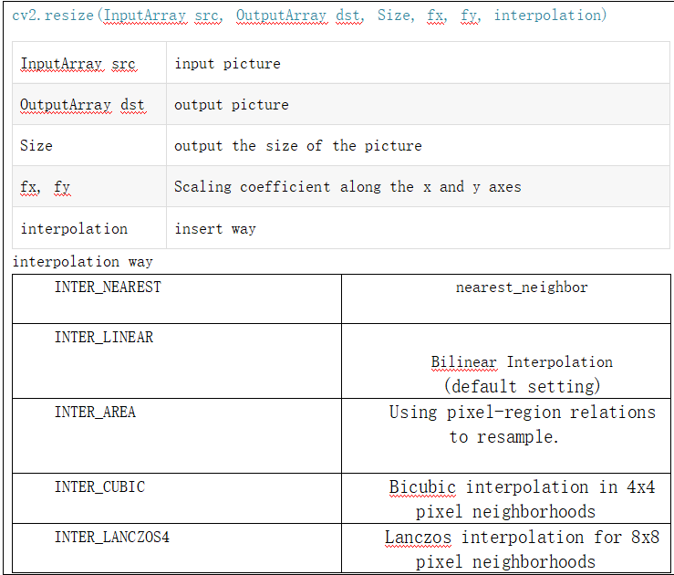
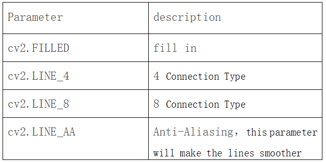
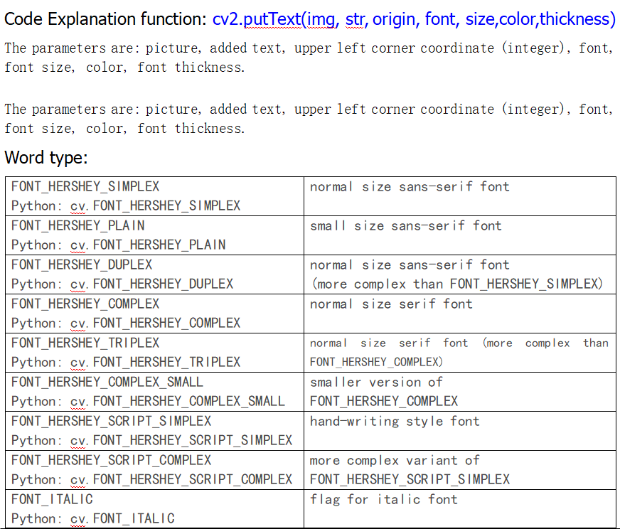

# 4.OpenCV Basic Lessons

## OpenCV Basic Lessons

First we need to install OpenCV. But we recommend you to use the system we provide, because it has incorporates openCV and tensorflow.

<span style="color: rgb(255, 76, 65);">Note:</span> need to turn off the programme of boot-up, then follow the below
instructions

Open the terminal and input **sudo nano /etc/rc.local** then press Enter


Add <span style="color: rgb(255, 76, 65);">#</span> before enabling the scripts, as shown below;


Press **Ctrl + o** to save, then press Enter and **Ctrl + X** to exit editing

## OpenCV


OpenCV means Open source Computer Vision Library. It’s an open-source software library for learning computer vision and machine.

OpenCV focuses on providing a common set of infrastructures for developing computer vision programs and enhancing the machine’s perception ability in commercial products. OpenVC library has over 2,500 optimized algorithms, which includes not only the classic ones and state-of-the-art computer vision and machine learning algorithms.

These algorithms can be used for face identification and detection, tracking moving objects, extracting three-dimensional models of objects, generating 3D point clouds from stereo cameras, and making up pictures to generate a high-resolution panoramic image and searching similar images from the image database and so on.

## 1. Read and Display Pictures

**1.1. Code:**

```python
import cv2  # Import the opencv

image = cv2.imread('car.jpeg', 1)  # Read the image named car2.jpeg from the same directory
cv2.imshow('sports car', image) # Displays the read images in a window named Sports Car
cv2.waitKey(5000) # Wait for 5 seconds
```

**1.2. Code explanation:**

image = cv2.imread('car2.jpeg', 1)

'car2 is the path of picture, jpeg' means how to read this picture

the second parameter has the following four ways:

cv2.IMREAD_UNCHANGED  # keep format unchanged, which can be represented by -1;

cv2.IMREAD_COLOR  # Read a picture in grayscale mode, which can be represented by 0;

cv2.IMREAD_GRAYSCALE,1 # Read in a color picture, which can be represented by 1;

cv2.IMREAD_UNCHANGED # Read in a picture and include its alpha channel, which can be represented by 2.


**1.3. Run the code and test result：**

Go to the “**opencv\_project**” file path and then run the code with python3, using the following command.

Enter the following two commands in the terminal respectively and press “Enter” key respectively:

`cd /home/pi/RaspberryPi-Car/opencv_project`

`sudo python3 pj1_read_show.py`

Run test code and plug in power, Pop out image. There is a window displaying pictures. After 5s, it automatically turns off.


## 2. Picture Quality

**2.1. Test code:**

```python
import cv2
img = cv2.imread('car.jpeg',1) #Read the pictures
cv2.imwrite('carTest.jpeg', img, [cv2.IMWRITE_JPEG_QUALITY, 50]) #Compress the image and save it
img2 = cv2.imread('carTest.jpeg',1) #Read the compressed image
cv2.imshow('car', img) 
cv2.imshow('carTest', img2)
cv2.waitKey(0)
```

**2.2. Code explanation:**

cv2.imwrite('carTest.jpeg', img, [cv2.IMWRITE_JPEG_QUALITY, 50])

The three parameters are shown below：

1. save the name and format of pictures;

2. read pictures;

3. image compression format and quality;

cv2.CV_IMWRITE_JPEG_QUALITY  # set the picture format to.jpeg or .jpg quality, in the range of 0---100 (the higher the value, the higher the quality),default as 95;

cv2.CV_IMWRITE_WEBP_QUALITY   # set the picture format to the picture quality of .webp format, in the range of 0--100;

cv2.CV_IMWRITE_PNG_COMPRESSION # Set the compression ratio of.png format, in the range of 0--9(The larger the value, the larger the compression ratio), default as 3.


**2.3. Run the code and test result:**

Go to the “**opencv\_project**” file path and then run the code with python3, using the following command.

Enter the following two commands in the terminal respectively and press “Enter” key respectively:

`cd /home/pi/RaspberryPi-Car/opencv_project`

`sudo python3 pj2_img_quality.py`

Run test code and plug in power, there are two windows as follows.

They shows the original image and the compressed image respectively.

You can figure out that the 50% compressed image is not as clear as the original image.


## 3. Pixel Operation
    
Pixel operation: you can alter the color of the pixel at any position.

**3.1. Test code:**

```python
import cv2 

img = cv2.imread('car.jpeg', 1)  # read photo
(b, g, r) = img[100, 100]  # Get the BGR value at the image coordinates [100, 100]
print(b, g, r) # print
x = 0
y = 0
#At the coordinates [100,100], draw a white square
for x in range(100, 200):
    img[x, y] = (255, 255, 255) # Assigns a value to the specified pixel color
    for y in range(100, 200):
        img[x, y] = (255, 255, 255)

cv2.imshow('image', img)
cv2.waitKey(0)
```

**3.2. Code explanation:**

(b, g, r) = img[100, 100]

obtain the BGR value at the designated coordinate and the returned value is a tuple.

img[x, y] = (255, 255, 255)

Alter the color alter the color value at the designated coordinate（BGR）.


**3.3. Run the code and test result:**

Enter the following two commands in the terminal respectively and press “Enter” key respectively:

`cd /home/pi/RaspberryPi-Car/opencv_project`

`sudo python3 pj3_piexl_operations.py`

Run test code and plug in power, Pop out image. A white square will be displayed.


## 4. Image Scaling
    
Image scaling is nothing new to us. Now, let’s perform the image scaling by the resize function.

**4.1. Test code:**

```python
import cv2

img = cv2.imread('car.jpeg', 1)
print(img.shape)  #Prints values for three channels

#Gets the values of the first two channels, that is, the length and width
x, y = img.shape[0:2]
cv2.imshow('originalPicture', img)
# Reduce the size of the image by two times. Default is linear compression
img1 = cv2.resize(img, (int(y/2), int(x/2)))
cv2.imshow('resize1', img1)
#cv2.waitKey(0)
# Resampling compression using pixel region relationships
img2 = cv2.resize(img, (0, 0), fx=1.5, fy=1.5, interpolation=cv2.INTER_NEAREST)
cv2.imshow('resize2', img2)
cv2.waitKey(0)
cv2.destroyAllWindows() # Close all Windows
```

**4.2. Code explanation:**




**4.3. Run the code and test result:**

Enter the following two commands in the terminal respectively and press “Enter” key respectively:

`cd /home/pi/RaspberryPi-Car/opencv_project`

`sudo python3 pj4\_geometric_transformation.py`

Run test code and plug in power, Pop out image.


## 5. Image Clipping
    
Clipping pictures is easy, and you only need to keep the pixel areas.

**5.1. Test code:**

```python
import cv2
img = cv2.imread('car.jpeg', 1)
img2 = img[100:500, 20:200] # Select rectangle X(100~500) Y(20~200)
cv2.imshow('image_src', img)
cv2.imshow('image2', img2)
cv2.waitKey(0)
```

**5.2. Run the code and test result:**

Enter the following two commands in the terminal respectively and press “Enter” key respectively:

`cd /home/pi/RaspberryPi-Car/opencv_project`

`sudo python3 pj5_cut_images.py

Run test code and plug in power, Pop out image.


## 6. Perspective Transformation
    
Perspective transformation is the process to project an image from one viewing plane to another. Therefore, perspective transformation is also referred as Projection Mapping. This has the effect that distant objects appear smaller than nearer objects..
    
Perspective transformation can map a rectangle to any quadrilateral.

In Maker's products, the automatic driving realized by camera recognition often uses perspective transformation

**6.1. code:**

```python
import cv2
import numpy as np

img = cv2.imread('car.jpeg',1)

imgInfo = img.shape
print(imgInfo)
height = imgInfo[0]
width = imgInfo[1]
#src 4->dst 4 Enter the coordinates of the four points of the image
matSrc = np.float32([[50,10],[50,200],[400,50],[400,230]])
matDst = np.float32([[100,30],[100,200],[400,100],[360,200]])
#Perspective conversion function
matAffine = cv2.getPerspectiveTransform(matSrc,matDst)# mat 1 src 2 dst
dst = cv2.warpPerspective(img,matAffine,(width,height))
img_bgr2rgb = cv2.cvtColor(dst, cv2.COLOR_BGR2RGB)
cv2.imshow('perspective', img_bgr2rgb)
cv2.waitKey(0)
```

**6.2. Code explanation:**

**Conversion matrix function**

cv2.getPerspectiveTransform(matSrc,matDst)

**matSrc：** input four vertex coordinates of the image. They are upper left corner, lower left corner, upper right corner, lower right corner.

**matDst：**  input four vertex coordinates of the image. They are upper left corner, lower left corner, upper right corner, lower right corner.

**Perspective transformation function**

dst = cv2. warpPerspective(src, M, dsize[,flag, [,borderMode[,borderValue]]])

**Dst:** the output image after the perspective transformation，dsize decides the real size.

**Src:** source image.

**M:** 3X3 transformation matrix.

**dsize:** output the image size.

**Flags:** Interpolation method，default as INTER_LINEAR( bilinear interpolation). When flags is WARP_INVERSE_MAP，which means that retransformation，and can achieve the retransformation from dst to src.

**borderModer:** default as BORDER_CONSTANT. When th value is BORDER_TRANSPARENT，the value in the target image does not change. And these values correspond the abnormal value in the original image.

**borderValue:** default as0.

**6.3. Run test code and test result:**

Enter the following two commands in the terminal respectively and press “Enter” key respectively:

`cd /home/pi/RaspberryPi-Car/opencv_project`

`sudo python3 pj6_perspective.py`

Run test code and plug in power, Pop out image.


## 7. Gray Processing
    
Converting colorful images into gray ones means the grayscale processing of the image.
    
The color of each pixel in a color image is determined by the three components of R, G, and B, and each can take a value of 0-255, so that a pixel can have more than 16 million (256\*256\*256=1677256).
    
The gray-scale image is a special color image with the same three components of R, G, and B and the variation range of one pixel is 256. Therefore, in digital image processing, images of various formats are generally converted into grayscale. The description of gray-scale images, the same as color images, still reflects the distribution and characteristics of the overall and partial chromaticity and high-brightness levels of the entire image.
    
Graying is the process of equalizing the R, G, and B components of the color. R=G=B, this value is also called the gray value
    
The pixel with larger gray value is brighter(maximum value reach to 255, white), on the contrary,when the pixel value is 0,dark
    
Pixels with large gray values are brighter (the maximum pixel value is 255, which is white), and vice versa (the lowest pixel is 0, which is black).
    
**Image graying algorithm**

Maximum value：that is R=G=B=max（R，G，B）. This way can transform the gray image with high brightness.

Average value: that is R=G=B=(R+G+B)/3. this way can produce the soft gray image.

Weighted average:according to some weighted value, and execute the weighted average for the value of R，G and B，that is.

Since the human eye is the most sensitive to green, red is the second, and the least sensitive to blue, it will be easier to identify grayscale images. Generally, the gray-scale image obtained by this algorithm has the best effect.

**7.1. Code1 maximum value:**

```python
import cv2

img = cv2.imread('car.jpeg', 1)
print("img = ", img.shape)
cv2.imshow('image', img)
dst = cv2.cvtColor(img, cv2.COLOR_BGR2GRAY)
print("gray = ", dst.shape)
cv2.imshow('gray', dst)
cv2.waitKey(0)
```

**7.2. Code explanation:**

dst = cv2.cvtColor(img, cv2.COLOR_BGR2GRAY)

**cv2.cvtColor(p1,p2)** is the function for color space change, p1 means the picture to transform，p2 means which formats it will transform

**7.3. Run test code 1 and test result:**

Enter the following two commands in the terminal respectively and press “Enter” key respectively:

`cd /home/pi/RaspberryPi-Car/opencv_project`

`sudo python3 pj7_gray_processing.py`

Run test code and plug in power, Pop out image.


**7.4. Code 2 average value:**

```python
import cv2
import numpy as np


img = cv2.imread('car.jpeg',1)
imgInfo = img.shape
height = imgInfo[0]
width = imgInfo[1]
# RGB R=G=B = gray  (R+G+B)/3
dst = np.zeros((height,width,3),np.uint8)
for i in range(0,height):
    for j in range(0,width):
        (b,g,r) = img[i,j]
        gray = (int(b)+int(g)+int(r))/3
        dst[i,j] = np.uint8(gray)

cv2.imshow('src',img)
cv2.imshow('dst',dst)
cv2.waitKey(0)

```

**7.5. Run code 2 and test result:**

Enter the following two commands in the terminal respectively and press “Enter” key respectively:

`cd /home/pi/RaspberryPi-Car/opencv_project`

`sudo python3 pj7_gray2.py`

Run test code and plug in power, Pop out image.


**7.6. Run test code 3 weighted average:**

```python
# gray = r*0.299+g*0.587+b*0.114  
import cv2
import numpy as np

img = cv2.imread('car.jpeg',1)
imgInfo = img.shape
height = imgInfo[0]
width = imgInfo[1]
dst = np.zeros((height,width,3),np.uint8)
for i in range(0,height):
    for j in range(0,width):
        (b,g,r) = img[i,j]
        b = int(b)
        g = int(g)
        r = int(r)
        gray = r*0.299+g*0.587+b*0.114
        dst[i,j] = np.uint8(gray)

cv2.imshow('src',img)
cv2.imshow('dst',dst)
cv2.waitKey(0)
```

**7.7. Run test code 3 and test result:**

Enter the following two commands in the terminal respectively and press “Enter” key respectively:

`cd /home/pi/RaspberryPi-Car/opencv_project`

`sudo python3 pj7_gray3.py`

Run test code and plug in power, Pop out image.


## 8. Image Binarization

Image binarization is the **process of taking a grayscale image and converting it to black-and-white**, essentially reducing the information contained within the image from 256 shades of gray to 2: black and white, a binary image. This is a task commonly performed when trying to extract an object from an image.

**Global Threshold：**

Python-OpenCV provides threshold function：cv2.threshold（src, threshold, maxValue, method）.


Src original picture：The black line is the value to be thresholded; the dotted line is the threshold.


cv2.THRESH\_BINARY：The gray value of pixels larger than the threshold is set to maxValue (The maximum value of 8-bit gray value is 255). The gray value of pixels with gray value less than the threshold is set to 0.


cv2.THRESH\_BINARY\_INV：The gray value of pixels larger than the
threshold is set to 0 ，and the value less than the threshold is set to maxValue.


cv2.THRESH\_TRUNC：When gray values of Pixels are less than the threshold,pixels don’t change, and pixels with gray values greater than the threshold.pixels will be set to the threshold.


cv2.THRESH\_TOZERO：

If the gray value of the pixel is less than the threshold value, no change will be made, and the gray value of the portion greater than the threshold value becomes 0.


cv2.THRESH\_TOZERO\_INV: If the gray value of the pixel is greater than the threshold, no change will be made. If the gray value of the pixel is less than the threshold, the gray value will all become zero.

**8.1. Code:**

```python
import cv2
import numpy as np

img = cv2.imread('car.jpeg', 1)

GrayImage = cv2.cvtColor(img, cv2.COLOR_BGR2GRAY)

ret,thresh1=cv2.threshold(GrayImage,30,255,cv2.THRESH_BINARY)
ret,thresh2=cv2.threshold(GrayImage,30,255,cv2.THRESH_BINARY_INV)
ret,thresh3=cv2.threshold(GrayImage,30,255,cv2.THRESH_TRUNC)
ret,thresh4=cv2.threshold(GrayImage,30,255,cv2.THRESH_TOZERO)
ret,thresh5=cv2.threshold(GrayImage,30,255,cv2.THRESH_TOZERO_INV)
titles = ['Gray Image','BINARY','BINARY_INV','TRUNC','TOZERO','TOZERO_INV']
images = [GrayImage, thresh1, thresh2, thresh3, thresh4, thresh5]

for i in range(6):
    cv2.imshow(titles[i], images[i])

cv2.waitKey(0)
```

**8.2. Run the code and test result:**

Enter the following two commands in the terminal respectively and press “Enter” key respectively:

`cd /home/pi/RaspberryPi-Car/opencv_project`

`sudo python3 pj8_binarization.py`

Run test code and plug in power, Pop out image.


## 9. Edge Detection

The purpose of edge detection is to significantly reduce the data size of the image while retaining the original image attributes.

At present, there are a variety of algorithms for edge detection, and the commonly used ones are Canny, Sobel, Scharr, and Laplace. Canny can subtract a lot of information, while Sobel and Scharr are more artistic.

Steps of Canny edge detection algorithm

1\. Use a Gaussian filter to smooth the image and filter out noise.

2\. Calculate the gradient intensity and direction of each pixel in the image.

3\. Non-Maximum Suppression is applied to eliminate the spurious response caused by edge detection.

4\. Apply double-threshold detection to determine true and potential edges.

5\. Finish the detection of edges by suppressing all the other edges that are weak.

**9.1. Code 1 canny:**

```python
import cv2
import numpy as np
import random

img = cv2.imread('car.jpeg', 1)
imgInfo = img.shape
height = imgInfo[0]
width = imgInfo[1]
cv2.imshow('src', img)
gray = cv2.cvtColor(img, cv2.COLOR_BGR2GRAY)
imgG = cv2.GaussianBlur(gray,(3,3),0)
dst = cv2.Canny(img,50,50)
cv2.imshow('dst', dst)
cv2.waitKey(0)


```

**9.2. Code 1 Explanation:**

imgG = cv2.GaussianBlur(gray,(3,3),0)

Gaussian filter function,filter out noise to make the image smoother
canny = cv2.Canny(image, threshold1, threshold2[, edges[, apertureSize[, L2gradient ]]])

Parameter：

The first parameter:processed original image,the image must be a single-channel grayscale image；

The second parameter: the minimum threshold；

The third parameter: the maximum threshold

**9.3. Run the code 1 and test result:**

Enter the following two commands in the terminal respectively and press “Enter” key respectively:

`cd /home/pi/RaspberryPi-Car/opencv_project`

`sudo python3 pj9_1_border_protection.py`

Run test code and plug in power, Pop out image. The basic outlook is shown from the below pictures. You can also adjust the threshold value.


**9.4. Code 2 Sobel Scharr:**

```python
import cv2

img = cv2.imread("car.jpeg")

gray = cv2.cvtColor(img, cv2.COLOR_RGB2GRAY)

sobel_x = cv2.Sobel(gray, cv2.CV_8U, 1, 0)
sobel_y = cv2.Sobel(gray, cv2.CV_8U, 0, 1)
sobel = cv2.Sobel(gray, cv2.CV_8U, 1, 1)

scharr_x = cv2.Scharr(gray, cv2.CV_8U, 1, 0)
scharr_y = cv2.Scharr(gray, cv2.CV_8U, 0, 1)

cv2.imshow("src", img)
cv2.imshow("Sobel_x", sobel_x)
cv2.imshow("Sobel_y", sobel_y)
cv2.imshow("Sobel", sobel)
cv2.imshow("Scharr_x", scharr_x)
cv2.imshow("Scharr_y", scharr_y)

cv2.waitKey(0)
```

**9.5. Code 2 explanation:**

cv2.Sobel(src,ddepth,dx,dy,dst=None,ksize=None,scale=None,delta=None,borderType=None)

**ddepth:** on account of different input images, the output targeted image has different depth; the specific combination is as follows: 

- if src.depth() = CV_8U, take out ddepth =-1/CV_16S/CV_32F/CV_64F
- if src.depth() = CV_16U/CV_16S, take out ddepth =-1/CV_32F/CV_64F
- if src.depth() = CV_32F, take out ddepth =-1/CV_32F/CV_64F
- if src.depth() = CV_64F, take out ddepth = -1/CV_64F
 
**dx:** int type，indicate the difference order along x direction，1 or 0;

**dy:** int type，indicate the difference order along y direction，1 or 0;

**kSize：** when kSize = 1，adapt the format 1*3 or 3*1. 

cv2.Scharr(src, ddepth, dx, dy, dst=None, scale=None, delta=None, borderType=None)

**9.6. Run code 2 and test result:**

Enter the following two commands in the terminal respectively and press “Enter” key respectively:

`cd /home/pi/RaspberryPi-Car/opencv_project`

`sudo python3 pj9_2_sobel.py`

Run test code and plug in power, Pop out image.


## 10. Line Segment Drawing
    
When using OpenCV to process images, we usually draw line segments and rectangles.

**10.1. Code: **

```python
import cv2
import numpy as np

newImageInfo = (600, 600, 3)
dst = np.zeros(newImageInfo, np.uint8)

cv2.line(dst, (100, 100), (200, 200), (255, 0, 0))

cv2.line(dst, (80, 100), (80, 200), (0, 255, 0), 10)
cv2.line(dst, (220, 100), (220, 200), (255, 0, 0), 10, cv2.LINE_AA)


cv2.imshow('dst', dst)
cv2.waitKey(0)
```
**10.2. Code 1 Explanation:**

Code Explanationcv2.line（dst，pt1，pt2，color，thickness=None，lineType=None，shift=None）Parameter description：

**dst：** Output image.

**pt1，pt2：** Required parameters. The coordinate points of the line segment respectively represent the start point and the end point.

**Color:** Required parameters. Used to set the color of the line segment.

**thickness：** Optional parameter.used to set the width of line segments.

**lineType：** Optional parameters.used to set the line segment typrused to set the line type.

**10.3. Run the code and test result:**

Enter the following two commands in the terminal respectively and press “Enter” key respectively:

`cd /home/pi/RaspberryPi-Car/opencv_project`

`sudo python3 pj10_painting_line.py`

Run test code and plug in power, Pop out image.


## 11. Graphics Drawing 

**Draw rectangle**

rectangle（img，pt1，pt2，color，thickness=None，lineType=None，shift=None）

Parameters description：

  - img：Canvas or carrier image

  - pt1，pt2：Required parameters.The vertices of the rectangle represent the vertices and the diagonal vertices, namely the upper left corner and the lower right corner of the rectangle (the two vertices can determine a unique rectangle)

  - color：Required parameters,used to set the color of rectangle

  - thickness：Optional parameters,used to set the width of rectangle; when the value is negative number,fill the rectangle.

  - lineType：optional parameter,used to set the line type. 8 can be selected
    
**Draw round**

cv2.circle(img, center, radius, color\[,thickness\[,lineType\]\])

Parameters description：

  - img:canvas or carrier image

  - center：coordinates of the central of the circle，format:(50,50)

  - radius

  - color

  - thickness：Line thickness, default as 1

  - lineType：Line type, default as 8，as follows



**Draw Oval**

cv2.ellipse(img, center, axes, angle, StartAngle, endAngle, color\[,thickness\[,lineType\]\])

  - center：center point of ellipse（x，x）

  - axes：indicate Short radius and long radius（x，x）

  - angle：angle of anticlockwise rotation

  - StartAngle：the angle of arc starting angle

  - endAngle:the angle of the end angle of the arc

  - Img,color can refer to the round:

  - \# The fifth parameter refers to the angle of drawing counterclockwise, and the sixth refers to the angle of the end of counterclockwise drawing .

  - \# If the four, five, and six parameters are added with a symbol, it means the opposite direction, that is, the clockwise direction.
    
**Draw Polygon**

cv2.polylines(img,\[pts\],isClosed, color\[,thickness\[,lineType\]\])

  - pts：Vertex of polygon

  - isClosed：close or not（True/False）

  - other parameters refer to the parameter of drawing round

**11.1. Code:**

```python
import cv2
import numpy as np

newImageInfo = (500, 500, 3)
dst = np.zeros(newImageInfo, np.uint8)

cv2.rectangle(dst, (350,100),(300,200),(0,0,255),5)
cv2.circle(dst,(100,100),(50),(255, 0, 0), 2)
cv2.ellipse(dst, (226,256), (120,80),0,0,360,(0,255,255),-1)

cv2.imshow('dst',dst)
cv2.waitKey(0)
```

**11.2. Run the code and test result:**

Enter the following two commands in the terminal respectively and press “Enter” key respectively:

`cd /home/pi/RaspberryPi-Car/opencv_project`

`sudo python3 pj11_drawGraphics.py`

Run test code and plug in power, Pop out image.


## 12. Word Editing
    
Sometimes we need to put on logo on the picture, so the word is edited. Opencv provides the function to edit word.

**12.1 Code:**

```python
import cv2
import numpy as np

img = cv2.imread('car.jpeg', 1)
font = cv2.FONT_HERSHEY_SIMPLEX

cv2.rectangle(img, (50,50),(480,220),(0,255,0),3)
cv2.putText(img,'car',(215,40),font,1,(200,200,0),2,cv2.LINE_AA)
cv2.imshow('src', img)
cv2.waitKey(0)
```
**12.2. Code explanation:**



**12.3. Run the code and test result:**

Enter the following two commands in the terminal respectively and press “Enter” key respectively:

`cd /home/pi/RaspberryPi-Car/opencv_project`

`sudo python3 pj12_text.py`

Run test code and plug in power, Pop out image.


## 13. Gaussian Mean Filter

Filtering: It is a basic task in signal and image processing. Its purpose is to selectively extract some important information in the image according to the different application environment. Filtering can remove noise in the image, extract visual features and allow image resampling, and so on.

Frequency domain analysis: Divide the image into different parts from low frequency to high frequency. The low frequency corresponds to the area where the image intensity changes little, and the high frequency is the area where the image intensity changes a lot.

Frequency domain analysis: Divide the image into different parts from low frequency to high frequency. The low frequency corresponds to the area where the image intensity changes little, and the high frequency is the area where the image intensity changes very much. In the framework of frequency analysis, a filter is an operation used to enhance a certain band or frequency in an image and block (or reduce) other frequency bands. The low-pass filter removes the high-frequency part of the image, but retains the low-frequency part. The high-pass filter eliminates the low frequency part.

Gaussian blur is essentially a mean blur, but Gaussian blur is based on a weighted average. The closer the distance is, the greater the weight, and the farther the distance is, the smaller the weight.

In layman's terms, Gaussian filtering is the process of weighted averaging the entire image. The value of each pixel is obtained by weighted averaging of itself and other pixel values in the neighborhood.

**13.1. Code:**

```python
import cv2
import numpy as np

img = cv2.imread('car.jpeg',1)
cv2.imshow('src',img)
# (5,5) indicates that both the length and width of the Gaussian matrix are 5
# The standard deviation is 1.5
dst = cv2.GaussianBlur(img,(5,5),1.5)
cv2.imshow('dst',dst)
cv2.waitKey(0)

```

**13.2 Run the code and test result:**

Enter the following two commands in the terminal respectively and press “Enter” key respectively:

`cd /home/pi/RaspberryPi-Car/opencv_project`

`sudo python3 pj13_gaussianBlur.py`

Run test code and plug in power, Pop out image.


