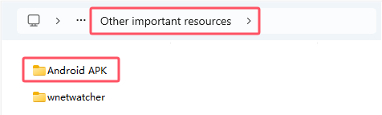

# 5. Control Raspberry Pi Camera by APP

## Control Raspberry Pi Camera by APP

<span style="color: rgb(255, 76, 65);">Note：The video streaming sent to App is processed using opencv, so the opencv needs installing on Raspberry Pi. We recommend using the Raspberry Pi imager system which has opencv and tensorflow. And the Raspberry Pi hotspot will be actived when booting up.</span>

<span style="color: rgb(255, 76, 65);">Note:</span> need to turn off the programme of boot-up, then follow the below instructions

Open the terminal and input **sudo nano /etc/rc.local** then press Enter


Add <span style="color: rgb(255, 76, 65);">#</span> before enabling the scripts, as shown below;


Press **Ctrl + o** to save, then press Enter and **Ctrl + X** to exit editing

There are two ways of communication between smartphone APP and RaspberryPi: Bluetooth communication and WiFi network communication.

In order to achieve video streaming and camera monitoring, WiFi network communication is used because Bluetooth communication can not work out this function. The TCP protocol sends commands to control the movement of the car and the UDP protocol receives the video streaming sent by the Raspberry Pi.

The module library for TCP and UDP communication in Python is generally“socket”which provides the standard BSD Sockets API. To learn more about“socket”, please follow this link：

[https://docs.python.org/3/howto/sockets.html](https://docs.python.org/3/howto/sockets.html)

## 1. APP communicates with Raspberry Pi through TCP

When the smartphone is connected to Raspberry Pi hotspot or smartphone
and Raspberry Pi in the same LAN (connect to the same WiFi), TCP protocol is used for communication. Raspberry Pi is server side, the smartphone APP is the client side.

**1.1. APP download and installation:**
    
(1) We provide “ keyes RPi Robot.apk” app.



(2) You can also download it from “Google play”：

Search **keyes RPi Robot** in the 

**1.2. APP interface:**


**1.3. Code:**

```python
import socket
import time
from OledModule.OLED import OLED
import RPi.GPIO as GPIO
GPIO.setwarnings(False)

def getLocalIp():
    '''Get the local ip'''
    try:
        s=socket.socket(socket.AF_INET,socket.SOCK_DGRAM) # Create a UDP socket
        s.connect(('8.8.8.8',80)) 
        ip=s.getsockname()[0]  # The returned IP address is obtained
    finally:
        s.close()
    return ip
    
def cameraAction(command):
    if command=='CamUp':
        print("camUp")
    elif command=='CamDown':
        print("camDown")
    elif command=='CamLeft':
        print("camLeft")
    elif command=='CamRight':
        print("camRight")
    elif command=='CamStop':
        print("camStop")

def motorAction(command):
    '''Set the action of motor according to the command'''
    if command=='DirForward':
        print("go")
    elif command=='DirBack':
        print("back")
    elif command=='DirLeft':
        print("left")
    elif command=='DirRight':
        print("right")
    elif command=='DirStop':
        print("stop")

def main():
    host=getLocalIp()
    print('localhost ip :'+host)
    port=5051
    #Init the tcp socket
    tcpServer=socket.socket(socket.AF_INET,socket.SOCK_STREAM) # Create a TCP socket
    tcpServer.bind((host,port))
    tcpServer.setblocking(0) #Set unblock mode
    tcpServer.listen(5) # Start listening for TCP incoming connections
    #Init oled module
    oled=OLED()
    oled.setup()
    oled.writeArea1(host)
    oled.writeArea3('State:')
    oled.writeArea4(' Disconnect')
    while True:
        try:
            time.sleep(0.001)
            # Accepts a TCP connection and returns (connect,address), 
            # where connect is the new socket object that can be used to receive and send data. 
            # Address is the address of the connected client.
            (client,addr)=tcpServer.accept()
            print('accept the client!')
            oled.writeArea4(' Connect')
            client.setblocking(0) # Set the socket to non-blocking mode
            while True:
                time.sleep(0.001)
                try:
                    #Accepts TCP socket data. The data is returned as a string
                    data=client.recv(1024) 
                    data=bytes.decode(data) # Get the final data
                    if(len(data)==0):
                        print('client is closed')
                        oled.writeArea4(' Disconnect')
                        break
                    motorAction(data)  # Passes the received data to the function
                    cameraAction(data)
                except socket.error:
                    continue
                except KeyboardInterrupt as e:
                    raise e
        except socket.error:
            pass
        except KeyboardInterrupt:
            clear()
            tcpServer.close() 
            oled.clear()
            port = 0000
        except Exception as e1:
            clear()
            tcpServer.close()
            oled.clear()
            
main() # Enter main program
```

**1.4. Code explanation:**

This code is just for the application of socket

Socket information：[https://docs.python.org/3/howto/sockets.html](https://docs.python.org/3/howto/sockets.html)

port=5051

As the port number set by the server, Raspberry PI can be modified by yourself. The port number of APP should be the same as this one

**1.5. Run code & test result:**

Enter the following two commands in the terminal respectively and press “Enter” key respectively:

`cd /home/pi/RaspberryPi-Car`

`sudo python3 socket\_test.py`

After running the code, the terminal will display Raspberry Pi IP address.


The OLED screen also shows the IP address of the Raspberry Pi and the connection status of the APP ( Disconnect).

Connect the phone to the hotspot of the Raspberry Pi or make them connect to the same same WiFi, then open the APP to enter the IP address and port number,. For example, the address of my Raspberry Pi is **192.168.1.126** and the port number is **5051**.


Click “**ENTER**” to connect. If the connection is successful, the terminal will display“accept the client\!”.


The connection status of the OLED display will change into “**Connect**”.

Then click the button on the APP interface to send data.


<span style="color: rgb(255, 76, 65);">Note: </span> press“Ctrl +C”to stop executing commands. If you encounter the following problem, this means that the background running failed to close. So you need to close the APP for a while or modify the port number.


Command “**jobs**” can check the running process in the background.

## 2. Control the car via APP 

In the previous lesson, we learned how to communicate with App and the Raspberry Pi. Then we will acquire how to control the car via app.

**2.1. Code:**

```python
import socket
import time
from OledModule.OLED import OLED
import RPi.GPIO as GPIO
GPIO.setwarnings(False)

servoPin1 = 5
servoPin2 = 6
servoPin3 = 7
angle1 = 90
angle2 = 90

GPIO.setup(servoPin1, GPIO.OUT)
GPIO.setup(servoPin2, GPIO.OUT)
GPIO.setup(servoPin3, GPIO.OUT)

def servoPulse(servoPin, myangle):
    pulsewidth = (myangle*11) + 500
    GPIO.output(servoPin,GPIO.HIGH)
    time.sleep(pulsewidth/1000000.0)
    GPIO.output(servoPin,GPIO.LOW)
    time.sleep(20.0/1000 - pulsewidth/1000000.0)

L_IN1 = 20
L_IN2 = 21
L_PWM1 = 0
L_IN3 = 22
L_IN4 = 23
L_PWM2 = 1

R_IN1 = 24
R_IN2 = 25
R_PWM1 = 12

R_IN3 = 26
R_IN4 = 27
R_PWM2 = 13

GPIO.setmode(GPIO.BCM)  # use BCM numbers
#set the MOTOR Driver Pin OUTPUT mode
GPIO.setup(L_IN1,GPIO.OUT)
GPIO.setup(L_IN2,GPIO.OUT)
GPIO.setup(L_PWM1,GPIO.OUT)

GPIO.setup(L_IN3,GPIO.OUT)
GPIO.setup(L_IN4,GPIO.OUT)
GPIO.setup(L_PWM2,GPIO.OUT)

GPIO.setup(R_IN1,GPIO.OUT)
GPIO.setup(R_IN2,GPIO.OUT)
GPIO.setup(R_PWM1,GPIO.OUT)

GPIO.setup(R_IN3,GPIO.OUT)
GPIO.setup(R_IN4,GPIO.OUT)
GPIO.setup(R_PWM2,GPIO.OUT)


GPIO.output(L_IN1,GPIO.LOW)
GPIO.output(L_IN2,GPIO.LOW)
GPIO.output(L_IN3,GPIO.LOW)
GPIO.output(L_IN4,GPIO.LOW)

GPIO.output(R_IN1,GPIO.LOW)
GPIO.output(R_IN2,GPIO.LOW)
GPIO.output(R_IN3,GPIO.LOW)
GPIO.output(R_IN4,GPIO.LOW)


#set pwm frequence to 1000hz
pwm_R1 = GPIO.PWM(R_PWM1,100)
pwm_R2 = GPIO.PWM(R_PWM2,100)
pwm_L1 = GPIO.PWM(L_PWM1,100)
pwm_L2 = GPIO.PWM(L_PWM2,100)

#set inital duty cycle to 0
pwm_R1.start(0)
pwm_L1.start(0)
pwm_R2.start(0)
pwm_L2.start(0)

def ahead():
    GPIO.output(L_IN1,GPIO.LOW)  #Upper Left forward
    GPIO.output(L_IN2,GPIO.HIGH)
    pwm_L1.ChangeDutyCycle(80)
    GPIO.output(L_IN3,GPIO.HIGH)  #Lower left forward
    GPIO.output(L_IN4,GPIO.LOW)
    pwm_L2.ChangeDutyCycle(80)
    GPIO.output(R_IN1,GPIO.HIGH)  #Upper Right forward
    GPIO.output(R_IN2,GPIO.LOW)
    pwm_R1.ChangeDutyCycle(80)
    GPIO.output(R_IN3,GPIO.LOW)  #Lower Right forward
    GPIO.output(R_IN4,GPIO.HIGH)
    pwm_R2.ChangeDutyCycle(80)

def left():
    GPIO.output(L_IN1,GPIO.HIGH)
    GPIO.output(L_IN2,GPIO.LOW)
    pwm_L1.ChangeDutyCycle(80)
    GPIO.output(L_IN3,GPIO.LOW)
    GPIO.output(L_IN4,GPIO.HIGH)
    pwm_L2.ChangeDutyCycle(80)
    GPIO.output(R_IN1,GPIO.HIGH)
    GPIO.output(R_IN2,GPIO.LOW)
    pwm_R1.ChangeDutyCycle(80)
    GPIO.output(R_IN3,GPIO.LOW)
    GPIO.output(R_IN4,GPIO.HIGH)
    pwm_R2.ChangeDutyCycle(80)

def right():
    GPIO.output(L_IN1,GPIO.LOW)
    GPIO.output(L_IN2,GPIO.HIGH)
    pwm_L1.ChangeDutyCycle(80)
    GPIO.output(L_IN3,GPIO.HIGH)
    GPIO.output(L_IN4,GPIO.LOW)
    pwm_L2.ChangeDutyCycle(80)
    GPIO.output(R_IN1,GPIO.LOW)
    GPIO.output(R_IN2,GPIO.HIGH)
    pwm_R1.ChangeDutyCycle(80)
    GPIO.output(R_IN3,GPIO.HIGH)
    GPIO.output(R_IN4,GPIO.LOW)
    pwm_R2.ChangeDutyCycle(80)

def rear():
    GPIO.output(L_IN1,GPIO.HIGH)
    GPIO.output(L_IN2,GPIO.LOW)
    pwm_L1.ChangeDutyCycle(80)
    GPIO.output(L_IN3,GPIO.LOW)
    GPIO.output(L_IN4,GPIO.HIGH)
    pwm_L2.ChangeDutyCycle(80)
    GPIO.output(R_IN1,GPIO.LOW)
    GPIO.output(R_IN2,GPIO.HIGH)
    pwm_R1.ChangeDutyCycle(80)
    GPIO.output(R_IN3,GPIO.HIGH)
    GPIO.output(R_IN4,GPIO.LOW)
    pwm_R2.ChangeDutyCycle(80)

def stop():
    pwm_L1.ChangeDutyCycle(0)
    pwm_L2.ChangeDutyCycle(0)
    pwm_R1.ChangeDutyCycle(0)
    pwm_R2.ChangeDutyCycle(0)

def clear():
    GPIO.cleanup()

def getLocalIp():
    '''Get the local ip'''
    try:
        s=socket.socket(socket.AF_INET,socket.SOCK_DGRAM)
        s.connect(('8.8.8.8',80))
        ip=s.getsockname()[0]
    finally:
        s.close()
    return ip
    
    
def cameraAction(command):
    global angle1
    global angle2
    if command=='CamUp':
        angle1 = angle1 - 1
        servoPulse(servoPin2, angle1)
        if(angle1 <= 0):
            angle1 = 0
    elif command=='CamDown':
        angle1 = angle1 + 1
        servoPulse(servoPin2, angle1)
        if(angle1 >= 180):
            angle1 = 180
        
    elif command=='CamLeft':
        angle2 = angle2 + 1
        servoPulse(servoPin3, angle2)
        if(angle2 >= 180):
            angle2 = 180
    elif command=='CamRight':
        angle2 = angle2 - 1
        servoPulse(servoPin3, angle2)
        if(angle2 <= 0):
            angle2 = 0


def motorAction(command):
    '''Set the action of motor according to the command'''
    if command=='DirForward':
        print("go")
        ahead()
    elif command=='DirBack':
        print("back")
        rear()
    elif command=='DirLeft':
        print("left")
        left()
    elif command=='DirRight':
        print("right")
        right()
    elif command=='DirStop':
        print("stop")
        stop()

def setCameraAction(command):
    if command=='CamUp' or command=='CamDown' or command=='CamLeft' or command=='CamRight':
        return command
    else:
        return 'CamStop'

            

def main():
    ks = 'keyestudio'
    #Init oled module
    oled=OLED()
    oled.setup()
    oled.writeArea1(ks)
    oled.writeArea3('State:')
    oled.writeArea4(' Disconnect')
    time.sleep(2) #Must add delay
    '''The main thread, control the motor'''
    host=getLocalIp()
    print('localhost ip :'+host)
    port=5051

    #Init the tcp socket
    tcpServer=socket.socket(socket.AF_INET,socket.SOCK_STREAM)
    tcpServer.bind((host,port))
    tcpServer.setblocking(0) #Set unblock mode
    tcpServer.listen(5)

    global cameraActionState #Set a state variable for steering module
    cameraActionState='CamStop'

    #Init oled module
    oled=OLED()
    oled.setup()
    oled.writeArea1(host)
    oled.writeArea3('State:')
    oled.writeArea4(' Disconnect')
    while True:
        try:
            time.sleep(0.001)
            (client,addr)=tcpServer.accept()
            print('accept the client!')
            oled.writeArea4(' Connect')
            client.setblocking(0)
            while True:
                time.sleep(0.001)
                cameraAction(cameraActionState)
                try:
                    data=client.recv(1024)
                    data=bytes.decode(data)
                    if(len(data)==0):
                        print('client is closed')
                        oled.writeArea4(' Disconnect')
                        break
                    motorAction(data)
                    cameraActionState=setCameraAction(data)
                except socket.error:
                    continue
                except KeyboardInterrupt as e:
                    raise e
        except socket.error:
            pass
        except KeyboardInterrupt:
            tcpServer.close()
            oled.clear()
            print("close")
            port = 0000
        except Exception as e1:
            tcpServer.close()
            oled.clear()
main()
```

**2.2. Run code and test result:**

Enter the following two commands in the terminal respectively and press “Enter” key respectively:

`cd /home/pi/RaspberryPi-Car`

`sudo python3 MainControl.py`

After running the code, connect your phone connects to the hotspot of Raspberry Pi. Then open the APP, enter the IP address of the Raspberry Pi and the port number. Next, press the APP interface buttons to control the car and the pan tilt of camera.

## 3. UDP protocol for camera monitoring

Raspberry Pi transmits the video streaming to the APP through UDP protocol and the App displays the monitoring screen. The principle is to send each frame of the video captured by the camera to the APP, frame by frame, and the APP interface continuously displays each frame of the picture, which becomes a video.

When we use “**openvc**” to process the video frames, use the command “**capture=cv2.VideoCapture(0)**” to activate the camera, draw on the command **success,frame=capture.read()** to get videos by frame, send the command **cv2.imencode** to compress picture and transmit data then input the command **server.sendall** to send out.

**3.1. Code:**

```python
import cv2
import numpy
import socket
import time
import struct

HOST='10.0.0.222'
#HOST='192.168.1.222'
PORT=5051  # 1024-5000
WIDTH=320
HEIGHT=240

server=socket.socket(socket.AF_INET,socket.SOCK_DGRAM)  # create a UDP 
server.setsockopt(socket.SOL_SOCKET,socket.SO_BROADCAST,1) #enable broadcast
# Can be used to specify the destination address/port
server.connect((HOST,PORT))
print('now starting to send frames...')
capture=cv2.VideoCapture(0)   # Enabling the Camera
# Sets the width and height of the image
capture.set(cv2.CAP_PROP_FRAME_WIDTH,WIDTH)
capture.set(cv2.CAP_PROP_FRAME_HEIGHT,HEIGHT)
try:
    while True:
        time.sleep(0.01)
        success,frame=capture.read()  # Read the video by frame
        if success and frame is not None:
            result,imgencode=cv2.imencode('.jpg',frame,[cv2.IMWRITE_JPEG_QUALITY,95])
            #result,imgencode=cv2.imencode('.webp',frame,[cv2.IMWRITE_WEBP_QUALITY,20])
            print(len(imgencode))
            server.sendall(imgencode)
            #print('have sent one frame')
except Exception as e:
    server.sendall(struct.pack('b',1))
    print(e)
    capture.release()
    server.close()
```

**3.2. Code explanation:**

**HOST='10.0.0.222'**

Modify into the IP address when the app connects to the hotspot of the Raspberry Pi. Open WiFi attributes to check.

**server.connect((HOST,PORT))**

Generally, the“sendto”function will be used to send data directly after the“UDP socket”is established, and the destination address/port must be specified in the parameters of the“sendto”function. 
But after the“UDP socket”is established, the“connect”function is used to specify the destination address/port, and the“send”and“sendall” functions can also be used to send data, because they already know each other’s address and port, and this information can also be obtained with“getsockname”.

**success,frame=capture.read()**

You can get videos by frame via **capture.read()**，success and frame are return values to obtain **capture.read()**. Capture is boolean value; if the frame is correct, return True; otherwise, False.

Frame is the image of each frame and also a three-dimensional matrix.

**result,imgencode=cv2.imencode('.jpg',frame,[cv2.IMWRITE_JPEG_QUALITY,95])**

**cv2.imencode():** transfer the picture format into the flow data and assign values to the RAM; used to compression of the picture data format.

**'.jpg':** encode the picture frame with jpg format.

**cv2.CV_IMWRITE_JPEG_QUALITY** :set picture format to .jpeg or .jpg picture quality，value is 0---100（the larger the value, the higher the picture quality)，default as 95.

**cv2.sendall()**

**sendall():** It will automatically determine the amount of content to be sent each time, then remove the part already sent from the total content and pass the rest on to “ **send()** ” for sending. This means that all the data will be sent out.

**3.3. Run code and test result:**

Enter the following two commands in the terminal respectively and press “Enter” key respectively:

`cd /home/pi/RaspberryPi-Car`

`sudo python3 FramesSend_test.py`

After running the code, the terminal prints out the data length of each image sent out.


Connect the phone to the hotspot of Raspberry Pi first and open the APP. You only need to enter the correct port number (5051) in the code, and IP address is not needed. Click “ENTER” to check the real-time camera monitoring.

## 4. Automatically obtain the IP address of your phone
    
After connecting the phone to the Raspberry PI hotspot in the last
class, I had to check the IP address assigned to the phone, and then fill it in the code, which was not very convenient to use. So we came up with a way for raspberry PI to automatically recognize the IP address of the phone.

It is intricate to obtain the IP address by checking cellphones. Therefore, we can use the Raspberry Pi to recognize the IP address.

So we need to use <span style="color: rgb(255, 76, 65);">ping</span> App to get the IP address of the Raspberry Pi

<span style="color: rgb(255, 76, 65);">Note:</span> if you don’t have the Raspberry Pi imager we provide, you need to install <span style="color: rgb(255, 76, 65);">scapy</span>

Enter the following two commands in the terminal respectively and press “Enter” key respectively:

`sudo pip3 install scapy-python3`

**4.1. Code:**

```python
#!/usr/bin/python
import cv2
import numpy
import socket
import time
import struct

from scapy.all import *
IPData = [0,1] # Store the size of the IP address of the phone
def Echo(packet):
    IP=(packet['IP'].src)
    Bigx=len(packet[Raw])
    global IPData
    IPData[0]=IP
    IPData[1]=Bigx
    print ("source IP:",IPData[0])
    print("Packet size：",IPData[1])
def Stop(packet):
    #if IPData[1] == 1111:
    return True

#sniff(iface="wlan0",filter="icmp[icmptype] = icmp-echo",count=1,prn=Echo,stop_filter=Stop)
#sniff(iface="eth0",filter="icmp[icmptype] = icmp-echo",count=1,prn=Echo,stop_filter=Stop)
while(IPData[0] == 0)or(IPData[0] == '10.0.0.1'):
    print("wait..")
    sniff(iface="wlan0",filter="icmp[icmptype] = icmp-echo",count=0,prn=Echo,stop_filter=Stop)
    print("IP = ",IPData[0])

print ("source IP:",IPData[0])
HOST=IPData[0]  # Assign the obtained IP address to HOST
#HOST='10.0.0.222'
#HOST='192.168.1.222'
PORT=5051
WIDTH=320
HEIGHT=240

server=socket.socket(socket.AF_INET,socket.SOCK_DGRAM)  # create a UDP 
server.setsockopt(socket.SOL_SOCKET,socket.SO_BROADCAST,1) #enable broadcast
server.connect((HOST,PORT))
print('now starting to send frames...')
capture=cv2.VideoCapture(0)
capture.set(cv2.CAP_PROP_FRAME_WIDTH,WIDTH)
capture.set(cv2.CAP_PROP_FRAME_HEIGHT,HEIGHT)
try:
    while True:
        try:
            time.sleep(0.01)
            success,frame=capture.read()
            if success and frame is not None:
                result,imgencode=cv2.imencode('.jpg',frame,[cv2.IMWRITE_JPEG_QUALITY,95])
                #result,imgencode=cv2.imencode('.webp',frame,[cv2.IMWRITE_WEBP_QUALITY,20])
                #print(len(imgencode))
                server.sendall(imgencode)
                #print('have sent one frame')
        except Exception as e:
            print(e)
            continue
except Exception as e:
    server.sendall(struct.pack('b',1))
    print(e)
    capture.release()
    server.close()
```

**4.2. Code explanation:**

**sniff(iface="wlan0",filter="icmp[icmptype] = icmp-echo",count=1,prn=Echo,stop_filter=Stop)**

**iface:** the NIC specified for packet capture.

**Filter: ** filter rule.

**Count:** the number of packets to capture, when set to 0 it is always captured.

**Prn:** define a callback function for each packet.

**stop_filter:** define a function. when it catches the specified data.

**4.3. Run code and test result:**

Enter the following two commands in the terminal respectively and press “Enter” key respectively:

`cd /home/pi/RaspberryPi-Car`

`sudo python3 FramesSend.py`

After running code, connect the hotspot of the Raspberry Pi, open App, input the IP address of the Raspberry Pi and designated port number. You can open another terminal to check the IP address of the Raspberry Pi. The command is **ip a**.


192.168.1.180 is the fixed IP address. Both of two addresses can be used.

Click“ENTER”to see the IP address of the mobile phone displayed on the terminal.


Then you can see the camera monitoring on the App.

## 5. Boot up the monitoring function of Raspberry Pi 

`sudo nano /etc/rc.local`

Previously we have to enter the command to run the code in the terminal; nevertheless it won’t work out when rebooting the Raspberry Pi. In many cases, we want to be able to run a specific function when booting up, so we need to boot up the corresponding program. Just write the command to be activated in “**rc.local**” .

Use the “**nano**” editor to open “**rc.local**” and write the start-up scripts for controlling the car and video surveillance.

Enter the following two commands in the terminal respectively and press “Enter” key respectively:

`sudo nano /etc/rc.local`


After writing the script, press "**Ctrl + O, Enter**" to save, and "**Ctrl +X**" to exit editing.

Restart the Raspberry Pi system: **sudo reboot**

After rebooting, connect the cellphone to the hotspot of Raspberry Pi.
Then open the APP interface, entering the IP address and port number (5051) and click“ENTER”, then the connection is successful. The APP interface will show the camera monitoring, pressing buttons to control the car movement and camera action.

If you fail, you can power off the Raspberry Pi and reboot it again.


