# Kit List

| # | Picture | Name | QTY |
| :--: | :--: | :--: | :--: |
| 1 | 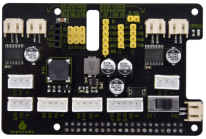| Raspberry Pi Motor Drive Shield | 1|
| 2 | 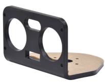 | Acrylic Board for Ultrasonic Sensor | 1 |
| 3 | 2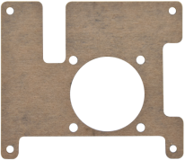| Acrylic Board for Cooling Fan | 1 |
| 4 | 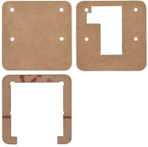| Acrylic Boards for Camera| 1 |
| 5 | 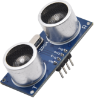|HC-SR04 Ultrasonic Sensor| 1 |
| 6 | 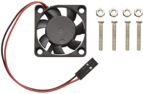| Cooling Fan | 1 |
| 7 | 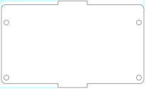|Acrylic Guard Board | 1 |
| 8 | 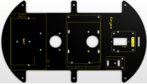| Top PCB Board | 1 |
| 9 | 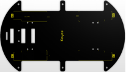|  Bottom PCB Board  | 1 |
| 10 | 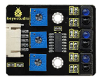| Keyestudio Line Tracking Sensor | 1 |
| 11 | 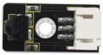| Keyestudio IR Receiver | 1 |
| 12 | 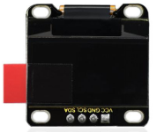| Keyestudio 0.96 Inch OLED Display | 1 |
| 13 | 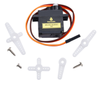| Keyestudio 9G 180°Metal Servo with Cross Horn | 1 |
| 14 | 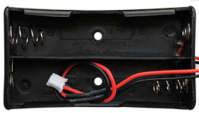| 18650 Battery Holder | 1 |
| 15 |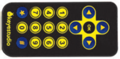| Keyestudio JMFP-4 17-Key Remote Control | 1 |
| 16 | 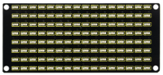| keyestudio 8x16 LED Panel | 1 |
| 17 | 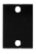| Fixed Part | 4 |
| 18 | | Wheel| 4 |
| 19 | 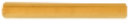| M3*60MM Dual-pass Copper Pillar | 4 |
| 20 | | M2.5*10MM Dual-pass Copper Pillar | 8 |
| 21 | | M3*40MM Dual-pass Copper Pillar | 6 |
| 22 | 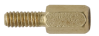|M2.5*6+6MM Copper Pillar| 4 |
| 23 | 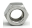| M2 Nuts | 8 |
| 24 | 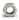| M1.4 Nuts| 10 |
| 25 | 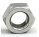| M3 Nuts | 14 |
| 26 | | 2.0*40MM Screwdriver | 1 |
| 27 | 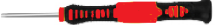| 3*40MM Screwdriver | 1 |
| 28 | 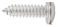| M1.2*5MM Round Head Screws | 6 |
| 29 | 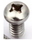|M3*6MM Round Head Screws | 29 |
| 30 | 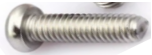| M3*30MM Round Head Screws | 8 |
| 31 | 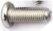| M3*8MM Round Head Screws | 4 |
| 32 | 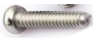|M2*10MM Round Head Screws | 7 |
| 33 | 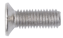| M3*8MM Flat Head Screws | 3 |
| 34 | 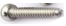|M1.4*10MM Round Head Screws| 10 |
| 35 | 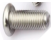| M2.5*6MM Round Head Screws | 13 |
| 36 | 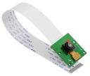| Five-Megapixel Raspberry  Pi Camera| 1 |
| 37 | 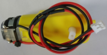| 4.5V 200r Motor | 4 |
| 38 | 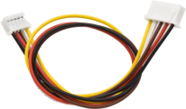| 5P XH2.54 to PH2.0 26AWG Connection Wire | 1 |
| 39 | 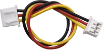| XH2.54 3P to PH2.0 3P Connection Wire | 1 |
| 40 | 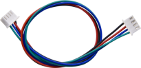|HX-2.54 4P Connection Wire | 1 |
| 41 | 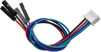|HX2.54mm-4P to 2.54 Dupont Wire | 1 |
| 42| 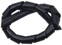| Winding Pipe | 1 |
| 43 | | Black Nylon Ties | 10 |
| 44 | 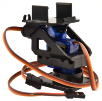| Pan Tilt Kit | 1 |

