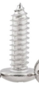

# Kit List

| # | Picture | Name | QTY |
| :--: | :--: | :--: | :--: |
| 1 | 2 | 3 | 3 |
| 1 | 2 | 3 | 3 |
| 1 | 2 | 3 | 3 |
| 1 | 2 | 3 | 3 |
| 1 | 2 | 3 | 3 |
| 1 | 2 | 3 | 3 |
| 1 | 2 | 3 | 3 |

<table>
<tbody>
<tr class="odd">
<td>#</td>
<td>Picture</td>
<td>Name</td>
<td>QTY</td>
</tr>
<tr class="even">
<td>1</td>
<td></td>
<td>
Raspberry Pi Motor

Drive Shield
</td>
<td>1</td>
</tr>
<tr class="odd">
<td>2</td>
<td></td>
<td>Acrylic Board for Ultrasonic Sensor</td>
<td>1</td>
</tr>
<tr class="even">
<td>3</td>
<td></td>
<td>Acrylic Board for Cooling Fan</td>
<td>1</td>
</tr>
<tr class="odd">
<td>4</td>
<td></td>
<td>Acrylic Boards for Camera</td>
<td>1</td>
</tr>
<tr class="even">
<td>5</td>
<td></td>
<td>HC-SR04 Ultrasonic Sensor</td>
<td>1</td>
</tr>
<tr class="odd">
<td>6</td>
<td></td>
<td>Cooling Fan</td>
<td>1</td>
</tr>
<tr class="even">
<td>7</td>
<td></td>
<td>Acrylic Guard Board</td>
<td>1</td>
</tr>
<tr class="odd">
<td>8</td>
<td></td>
<td>Top PCB Board</td>
<td>1</td>
</tr>
<tr class="even">
<td>9</td>
<td></td>
<td>Bottom PCB Board</td>
<td>1</td>
</tr>
<tr class="odd">
<td>10</td>
<td></td>
<td>Keyestudio Line Tracking Sensor</td>
<td>1</td>
</tr>
<tr class="even">
<td>11</td>
<td></td>
<td>Keyestudio IR Receiver</td>
<td>1</td>
</tr>
<tr class="odd">
<td>12</td>
<td></td>
<td>
Keyestudio 0.96 Inch

OLED Display
</td>
<td>1</td>
</tr>
<tr class="even">
<td>13</td>
<td></td>
<td>Keyestudio 9G 180°Metal Servo with Cross Horn</td>
<td>1</td>
</tr>
<tr class="odd">
<td>14</td>
<td></td>
<td>18650 Battery Holder</td>
<td>1</td>
</tr>
<tr class="even">
<td>15</td>
<td></td>
<td>Keyestudio JMFP-4 17-Key Remote Control</td>
<td>1</td>
</tr>
<tr class="odd">
<td>16</td>
<td></td>
<td>keyestudio 8x16 LED Panel</td>
<td>1</td>
</tr>
<tr class="even">
<td>17</td>
<td></td>
<td>Fixed Part</td>
<td>4</td>
</tr>
<tr class="odd">
<td>18</td>
<td></td>
<td>Wheel</td>
<td>4</td>
</tr>
<tr class="even">
<td>19</td>
<td></td>
<td>M3*60MM Dual-pass Copper Pillar</td>
<td>4</td>
</tr>
<tr class="odd">
<td>20</td>
<td></td>
<td>M2.5*10MM Dual-pass Copper Pillar</td>
<td>8</td>
</tr>
<tr class="even">
<td>21</td>
<td></td>
<td>M3*40MM Dual-pass Copper Pillar</td>
<td>6</td>
</tr>
<tr class="odd">
<td>22</td>
<td></td>
<td>M2.5*6+6MM Copper Pillar</td>
<td>4</td>
</tr>
<tr class="even">
<td>23</td>
<td></td>
<td>M2 Nuts</td>
<td>8</td>
</tr>
<tr class="odd">
<td>24</td>
<td></td>
<td>M1.4 Nuts</td>
<td>10</td>
</tr>
<tr class="even">
<td>25</td>
<td></td>
<td>M3 Nuts</td>
<td>14</td>
</tr>
<tr class="odd">
<td>26</td>
<td></td>
<td>2.0*40MM Screwdriver</td>
<td>1</td>
</tr>
<tr class="even">
<td>27</td>
<td></td>
<td>3*40MM Screwdriver</td>
<td>1</td>
</tr>
<tr class="odd">
<td>28</td>
<td></td>
<td>M1.2*5MM Round Head Screws</td>
<td>6</td>
</tr>
<tr class="even">
<td>29</td>
<td></td>
<td>M3*6MM Round Head Screws</td>
<td>29</td>
</tr>
<tr class="odd">
<td>30</td>
<td></td>
<td>M3*30MM Round Head Screws</td>
<td>8</td>
</tr>
<tr class="even">
<td>31</td>
<td></td>
<td>M3*8MM Round Head Screws</td>
<td>4</td>
</tr>
<tr class="odd">
<td>32</td>
<td></td>
<td>M2*10MM Round Head Screws</td>
<td>7</td>
</tr>
<tr class="even">
<td>33</td>
<td></td>
<td>M3*8MM Flat Head Screws</td>
<td>3</td>
</tr>
<tr class="odd">
<td>34</td>
<td></td>
<td>M1.4*10MM Round Head Screws</td>
<td>10</td>
</tr>
<tr class="even">
<td>35</td>
<td></td>
<td>M2.5*6MM Round Head Screws</td>
<td>13</td>
</tr>
<tr class="odd">
<td>36</td>
<td></td>
<td>Five-Megapixel Raspberry Pi Camera</td>
<td>1</td>
</tr>
<tr class="even">
<td>37</td>
<td></td>
<td>4.5V 200r Motor</td>
<td>4</td>
</tr>
<tr class="odd">
<td>38</td>
<td></td>
<td>5P XH2.54 to PH2.0 26AWG Connection Wire</td>
<td>1</td>
</tr>
<tr class="even">
<td>39</td>
<td></td>
<td>XH2.54 3P to PH2.0 3P Connection Wire</td>
<td>1</td>
</tr>
<tr class="odd">
<td>40</td>
<td></td>
<td>HX-2.54 4P Connection Wire</td>
<td>1</td>
</tr>
<tr class="even">
<td>41</td>
<td></td>
<td>HX2.54mm-4P to 2.54 Dupont Wire</td>
<td>1</td>
</tr>
<tr class="odd">
<td>42</td>
<td></td>
<td>Winding Pipe</td>
<td>1</td>
</tr>
<tr class="even">
<td>43</td>
<td></td>
<td>Black Nylon Ties</td>
<td>10</td>
</tr>
<tr class="odd">
<td>44</td>
<td></td>
<td>Pan Tilt Kit</td>
<td>1</td>
</tr>
</tbody>
</table>
